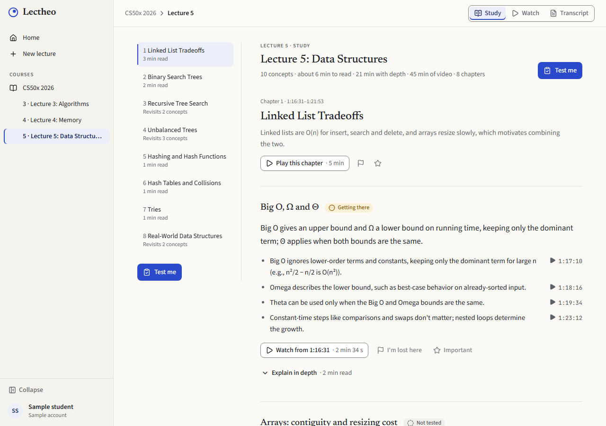
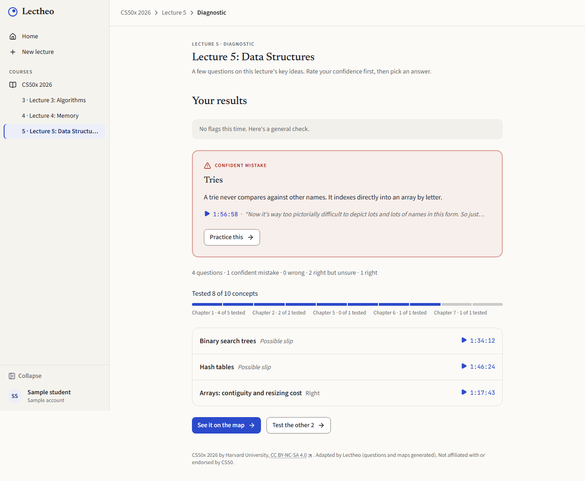
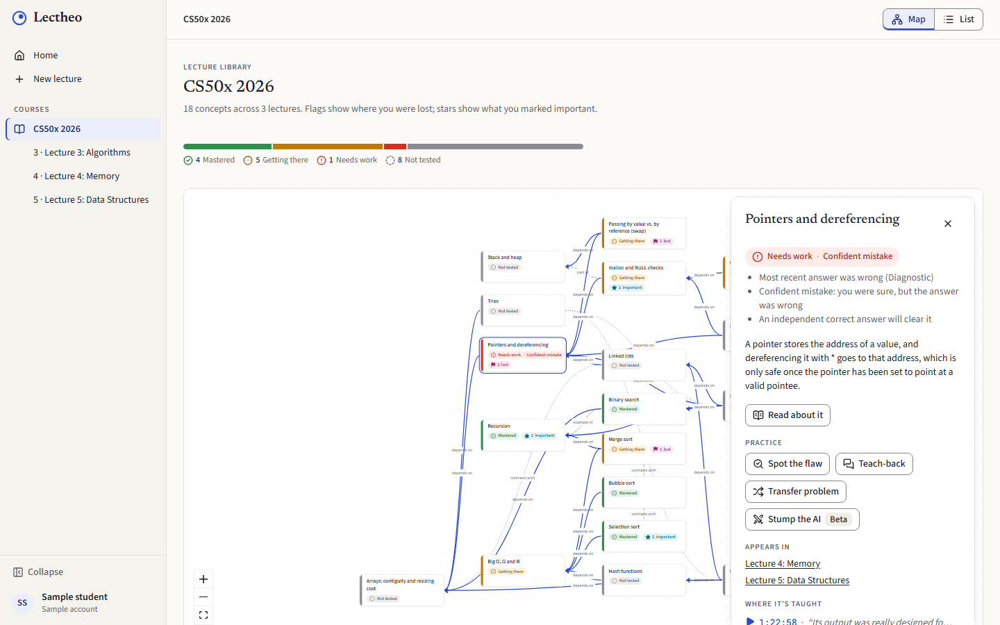
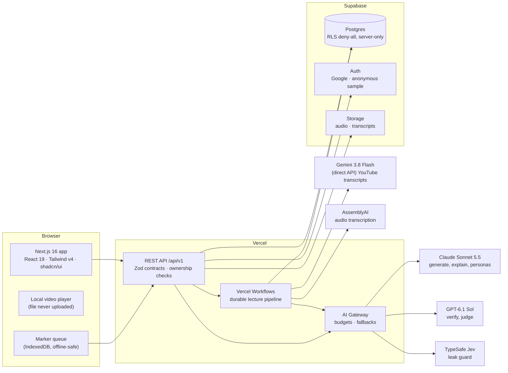

<div align="center">

<h1>&nbsp;Lectheo</h1>

**Find what you missed. Prove what you know.**

An AI study partner that finds what _you_ misunderstood in a lecture, then makes you reason with it until you can prove you understand it.

[](https://lectheo.vercel.app)
[](#track)
[](LICENSE)


[**Try it**](https://lectheo.vercel.app) · [**Demo video**](https://www.youtube.com/watch?v=t8TmaOyAQa4) · [How it works](#how-it-works) · [Technical approach](#technical-approach) · [What works](#what-works-and-what-doesnt)



</div>

**Lectheo (LEK-thee-oh)** turns a lecture into a personal map of understanding. You study a short brief of the lecture (or watch it) and mark what's unclear. A confidence-rated diagnosis then finds your **confident mistakes**: ideas you are sure about and get wrong. Practice that needs reasoning, not recall, follows. A concept counts as mastered only once you've shown it on your own, two different ways.

## Contents

- [Track](#track)
- [Demo](#demo)
- [The problem](#the-problem)
- [Who it's for](#who-its-for)
- [How it works](#how-it-works)
- [Real-world impact](#real-world-impact)
- [Technical approach](#technical-approach)
- [What works and what doesn't](#what-works-and-what-doesnt)
- [Quality and evaluation](#quality-and-evaluation)
- [Getting started](#getting-started)
- [Data and privacy](#data-and-privacy)
- [How this was built](#how-this-was-built)
- [License and credits](#license-and-credits)

## Track

**ForgeHacks 2026 · Track 02: AI + Education**: _"Build an AI-powered solution that helps learners move beyond memorization to understand concepts, make connections, and apply what they learn."_

Lectheo answers each part of that prompt:
- **Beyond memorization:** no flashcards or recall quizzes. Every activity asks you to judge, explain or apply an idea.
- **Make connections:** a concept map with prerequisite links traces a "lost" moment back to the earlier idea it depends on.
- **Apply what they learn:** spot the flaw, teach-back and transfer problems make you use the idea, and mastery needs two different kinds of evidence.

## Demo

- **Live app:** [lectheo.vercel.app](https://lectheo.vercel.app). Choose **Try the sample account**. There's no sign-up: you get your own copy of a student partway through Harvard's CS50x, with Lectures 3–5 ready, some marks made and a diagnostic taken. It is deleted after 24 hours. To add your own lectures, continue with Google: a Google account starts empty.
- **Demo video (4 min):** [watch on YouTube](https://www.youtube.com/watch?v=t8TmaOyAQa4)

  [](https://www.youtube.com/watch?v=t8TmaOyAQa4)

- **Two-minute judge path:**
  1. Sample account → **Lecture 5 · Study**: chapters, then **Explain in depth** on a concept.
  2. Press **I'm lost** on a concept → **Test me**.
  3. Rate your confidence _before_ seeing the options. A sure-and-wrong answer gets a follow-up, and twice wrong becomes a **confident mistake**, linked to the lecture moment.
  4. **Spot the flaw** on that concept: question the AI author, find the flawed sentence, get a guiding question and a second try.
  5. Back on the **map**, the concept's state has changed.

## The problem

Students leave long, concept-heavy lectures either lost partway through or with notes they never process. When they review, they mostly reread or do recall quizzes. That builds _familiarity_, the "I've seen this before" feeling, not _understanding_: rereading is among the lowest-utility study techniques (Dunlosky et al., 2013, _Psychological Science in the Public Interest_).

What students are missing:
- **Nobody tells them which specific ideas they don't understand.** Today's tools summarise what the lecture _covered_; they don't diagnose what this student _missed_.
- **The worst gaps can't be felt.** If you're sure about something wrong, you won't review it, and you'll get it wrong again in the exam. A topic you marked "lost" often comes from an earlier idea you _thought_ you understood.
- **Two-hour lectures are a barrier to testing yourself.** Nobody rewatches a whole lecture before finding out what they don't know.

## Who it's for

**Primary users:** undergraduates in concept-heavy computer science courses (intro CS, algorithms, data structures, systems) who learn from lectures, live or recorded. They're short on time, have recordings or transcripts from Teams, Zoom, Panopto or YouTube, and study on a laptop.

The sample uses **Harvard CS50x 2026, Lectures 3–5** (algorithms, memory, data structures). These are well known and full of classic misconceptions: Big-O, pointers, swap-by-value, hash-table cost.

## How it works

| Step | What you do | What Lectheo does |
|---|---|---|
| **1. Study or watch** | Read a brief of the lecture, chapter by chapter, in minutes, and open any idea in depth. Or watch it and press **L** ("I'm lost") or **I** ("Important"). | Splits the lecture into AI chapters, explains each concept from the lecture with links to the exact moments, and records your marks. |
| **2. Map** | See the lecture as a concept map with your marks on it. | Builds the map of the whole lecture with prerequisite links, so confusion is traced back to where it started. |
| **3. Diagnose** | Answer 3–6 questions, rating your confidence _before_ you see the options. | Picks questions from your marks, follows up on sure-but-wrong answers, flags **confident mistakes**, and shows how much of the lecture was tested, with **Test the rest** for the remainder. |
| **4. Practice** | **Spot the flaw** (find the error in an AI author's explanation), **Teach-back** (explain it to a curious first-year), **Transfer** (a problem the lecture never covered), **Stump the AI** (beta). | Grades against a fixed rubric with a separate judge, gives a guiding question and a second try before the answer, and links feedback to the lecture. |
| **5. Master** | Watch concepts move from _Not tested_ to _Needs work_, _Getting there_, _Mastered_. | Marks a concept **Mastered** only after two independent correct answers in two different activity types. Hints or revealed answers don't count. No points, streaks or badges. |

Bring your own lecture: a recording plus its `.vtt` / `.srt` captions (the video plays from your laptop and is never uploaded), an audio file (transcribed, then deleted), a pasted or uploaded transcript, or a **YouTube link** (transcribed by Gemini).

<table>
<tr>
<td></td>
<td></td>
</tr>
<tr>
<td align="center"><sub>Diagnosis: confident mistakes first, with coverage</sub></td>
<td align="center"><sub>Concept map with mastery states and your marks</sub></td>
</tr>
</table>

## Real-world impact

- **It targets the gap students can't see.** Confidence-before-options plus an adaptive follow-up separate a slip from a real misconception. A confident mistake is the finding most likely to cost marks in an exam and the least likely to be revised on your own.
- **It saves time where it matters.** A two-hour lecture becomes a brief you can read in about 15 minutes, a diagnosis of a few minutes, and practice only on the weak spots. You watch only the clips you need.
- **It trains the skills exams test.** Judging an explanation, explaining an idea, and applying it to a new problem are the higher-utility practices that rereading and summaries skip.
- **It works with the lectures students already have.** No instructor setup or institutional integration: any captioned recording, audio, transcript or public YouTube lecture.
- **It's trustworthy enough to learn from.** Every question is checked by a second AI model before a student sees it, grading uses fixed rubrics and a separate judge, and every result links to the lecture moment, so a student can check it.
- **It's cheap and open.** A full judge path costs about $0.10–0.15 in AI calls and a 60-minute lecture about $0.90 to process. The code is MIT-licensed, and video never leaves the student's laptop.

Who benefits: students in large lecture courses with little one-to-one help, students who study from recordings, and anyone preparing for an exam who wants to know what they _actually_ don't understand.

## Technical approach

### Architecture



**The lecture pipeline** runs as a durable Vercel Workflow, so every step retries safely and the page can be closed:

```
transcript (captions · audio via AssemblyAI · YouTube via Gemini, 2-min clips in parallel)
  → segment (≤ 40 s sentence groups)
  → extractConcepts (concepts, prerequisite links, chapters anchored to transcript lines)
  → validateGraph (citations exist, no cycles, dedupe with the course)
  → layoutMap (ELK) → alignMarkers → map_ready
  → draftItems → verifyItems (blind-solved by a second model family, ≤ 1 redraft)   ┐ in parallel
  → explainConcepts (in-depth explanations citing transcript lines)                  ┘
  → ready
```

### Where the AI does useful work

| Role | Model | Job | Why this design |
|---|---|---|---|
| Generate | Claude Sonnet 5.5 (Opus 5.5 for the one-time library seed) | Concepts, prerequisite links and chapters; diagnostic questions with misconception-based options; spot-the-flaw scenarios; in-depth explanations | Every output cites transcript **segment indexes**, never times or free text, so the server can check it and turn it into exact lecture links |
| Verify | GPT-6.1 Sol | Blind-solves every generated question without seeing the key; mismatches are redrafted once or dropped | A different model family avoids correlated blind spots; nothing reaches a student unverified |
| Judge | GPT-6.1 Sol | Grades corrections and explanations against a rubric written _before_ the activity | Separate from the character you talk to; whatever can be checked exactly (which sentence holds the flaw) is checked in code |
| Personas | Claude Sonnet 5.5 | The AI "author" who defends a flawed explanation; Sam, the curious first-year in teach-back | The author never sees the flaw it's hiding |
| Guard | TypeSafe Jev → GPT-6 Luna on grey cases | Checks every author reply for answer leaks before it's shown | Fails closed with a canned deflection |
| Transcribe | Gemini 3.8 Flash, direct Google API | YouTube lectures, 2-minute clips in parallel, stitched | Measured in a spike: 5.5% word error rate, p95 timestamp drift 2.6 s, $0.42 per hour of video |

### Engineering decisions that keep it correct

- **Information hiding by construction:** answer keys, flaws, rubrics, hints and leak keywords live in separate server-only tables, and every response passes an explicit Zod schema, so unknown keys are stripped. A test guards every route.
- **Mastery is computed on read** from attempts, never cached, so it can't drift from the evidence.
- **Safe retries:** client-generated UUIDv7 ids with `ON CONFLICT DO NOTHING`, and guarded state transitions (`… WHERE status = 'active' RETURNING`).
- **Spend governor:** every AI call is logged with its cost. New processing pauses at $3 in an hour or 75% of the budget, and all AI pauses at 95%, while prepared practice keeps working. Per-user daily quotas cap abuse.
- **Untrusted text** (transcripts, student answers) is always delimited in prompts; the models have no tools or actions.
- **Ownership:** another user's resource returns 404, never 403. Postgres row-level security denies all client access; only the server talks to the database.

### Components

| Layer | Tech |
|---|---|
| App | Next.js 16 (App Router), React 19, TypeScript, Tailwind CSS v4, shadcn/ui, lucide icons, React Flow + ELK for the map |
| API | REST under `/api/v1`, thin route handlers, Zod schemas shared in `packages/contracts` |
| Pipeline | Vercel Workflows (durable steps) |
| AI | Vercel AI SDK 7 through Vercel AI Gateway (budgets, fallbacks), one `runTask()` seam with role-based model routing and a deterministic fake mode |
| Data | Supabase Postgres, Auth (Google OAuth, anonymous sample accounts) and Storage; Drizzle ORM and migrations |
| Media | YouTube IFrame API, local `<video>` via object URLs, AssemblyAI, YouTube Data API |
| Abuse and safety | Cloudflare Turnstile, per-IP and per-user limits, spend governor |
| Tests | Vitest with in-process PGlite (no Docker), Playwright e2e with `AI_FAKE=1`: **677 unit and integration tests in 83 files, 13 e2e specs** |
| Monorepo | pnpm workspaces + Turborepo |

More detail: [Product Spec](docs/Lectheo%20Product%20Spec.md) · [Architecture](docs/Lectheo%20Architecture.md) · [API Spec](docs/Lectheo%20API%20Spec.md) · [Data Model](docs/Lectheo%20Data%20Model.md) · [Tech Stack and ADRs](docs/Lectheo%20Tech%20Stack.md) · [Design System](docs/Lectheo%20Design%20System.md)

## What works and what doesn't

Everything below is live at [lectheo.vercel.app](https://lectheo.vercel.app) unless marked otherwise.

| Area | Status |
|---|---|
| Sample account (CS50x Lectures 3–5, pre-loaded student) and Google sign-in; account and course deletion | ✅ Works |
| Study mode: chapters, outline, key points with lecture links, **Explain in depth** | ✅ Works |
| Watch mode with L / I marking, transcript and chapters panel, *play this chapter only* | ✅ Works |
| Add a lecture: recording + `.vtt` / `.srt`, audio upload, transcript paste or upload, YouTube link | ✅ Works (YouTube: English, public or unlisted, embeddable, 5 min to 2 h) |
| Concept map and list view, prerequisite links, marker timeline | ✅ Works |
| Diagnostic: confidence first, follow-ups, confident mistakes, coverage and *Test the rest* | ✅ Works |
| Spot the flaw, Teach-back | ✅ Works |
| Transfer problems | ✅ Works when a verified transfer item exists for the concept |
| Stump the AI | 🧪 Beta |
| Mastery map and next-step recommendations | ✅ Works |
| Live in-browser lecture recording | ❌ Cut (audio upload covers in-person lectures) |
| Slides as extra input, transcript correction, persona picker, Teams `.docx` import | ❌ Not built (Teams offers `.vtt`, which works) |

**Known limits:**
- English lectures only.
- Designed for a laptop: phones are usable, but the map and watch mode are desktop-first.
- Activities are written for CS concepts.
- Sample accounts get one lecture a day, up to 20 minutes; Google accounts get three a day, up to 2 hours.
- The evals below use small samples.

## Quality and evaluation

The CS50 library bank is generated offline by `scripts/seed-library.ts` from the official subtitles (Opus 5.5 extraction and drafting, GPT-6.1 Sol blind verification, at most one redraft round) and committed as fixtures, so seeding makes no AI calls. Evals write CSVs to [`docs/evals/`](docs/evals/):

| Check | Result |
|---|---|
| Library bank (18 concepts, 3 × 45-min windows) | 95 drafts, 6 rejected by the verifier (6%), one redraft round; then 18 reviewer-requested redrafts (all verified first try) and reviewed text fixes. 90 verified items. One-time cost $5.25 |
| `eval-items`: 20-item sample checked against key and cited subtitles | 20/20 correct key, single answer, grounded. Reviewed by Claude and checked by the author; an earlier human PR review found content issues this sample missed, now fixed (see `scripts/lib/reviewed.ts`) |
| `eval-judge`: 10 corrections × 3 runs | 100% score agreement (target ≥ 95%); the majority matches the case label 10/10 (labels written by Claude, reviewed by the author) |
| `eval-guard`: 15 adversarial author prompts (leak check) | 1/15 first replies blocked and regenerated, 0/15 deflected to the canned reply, 0/15 shown replies judged leaking |
| YouTube transcription spike ([report](docs/spikes/youtube-transcripts.md)) | CS50 Lecture 3 against its official subtitles: 5.5% word errors, 97.3% of cue times within 5 s, $0.42 per hour; a second lecture also met the targets |

```bash
pnpm --filter @lectheo/scripts seed-library -- --emit   # AI_FAKE=0, AI_GATEWAY_KEY_NAME=dev
pnpm --filter @lectheo/scripts eval-items               # no model calls
pnpm --filter @lectheo/scripts eval-judge
pnpm --filter @lectheo/scripts eval-guard
```

## Getting started

Requirements: Node 24, pnpm 12, Docker (only for the local Supabase stack).

```bash
pnpm install
cp .env.example apps/web/.env.local     # fill in keys, or `vercel env pull`
pnpm supabase start                     # local Postgres + Auth + Storage (Docker)
pnpm db:migrate && pnpm db:seed         # schema + CS50 library fixture + seed student
pnpm dev                                # http://localhost:3000
```

`AI_FAKE=1` makes every AI call deterministic and offline (tests, e2e, UI work without keys).

| Command | What |
|---|---|
| `pnpm check` | typecheck + lint + unit tests for every package |
| `pnpm test` | Vitest (domain rules, contracts, DB via in-process PGlite) |
| `pnpm e2e` | Playwright judge path (see below) |
| `pnpm db:generate` | new Drizzle migration from `packages/db/src/schema.ts` |
| `pnpm --filter @lectheo/ai smoke` | one live call per model role (needs `AI_GATEWAY_API_KEY`) |

`pnpm e2e` needs `npx supabase start` running. It reads keys from `supabase status`, refuses a non-local database, migrates and re-seeds it, then builds and serves the app on port 3100 with `AI_FAKE=1` and Cloudflare's always-pass Turnstile test keys. Sign-in loads Turnstile and the watch test loads YouTube (or the MP3 fallback), so it needs internet. First run: `pnpm --filter @lectheo/web exec playwright install chromium`.

### Repository layout

```
apps/web              Next.js 16 app: UI, REST API (/api/v1), ingestion workflow
  src/app             pages + thin route handlers (auth → zod → service → response schema)
  src/server          server-only services by feature (auth, http, quota, lectures, pipeline, ...)
  src/client          browser-only code (api client, capture: players, marker queue)
  src/components      UI components (shadcn/ui based)
  e2e                 Playwright (judge path, AI_FAKE=1)
packages/contracts    Zod schemas for every API request/response, enums, jsonb shapes
packages/db           Drizzle schema, migrations, PGlite test harness, CS50 seed fixture
packages/domain       pure, unit-tested rules (mastery, recommender, alignment, scoring, parsers)
packages/ai           the single AI seam: runTask() with role-based model routing + fake mode
scripts               library seed, evals, one-off scripts
docs                  product spec, architecture, API, data model, tech stack, design system
```

## Data and privacy

- **Imported video never leaves your laptop.** It plays locally; only the transcript is uploaded.
- Uploaded audio is **deleted after transcription**, and the copy at AssemblyAI is deleted too.
- Speaker names are stripped from imported transcripts.
- Deleting a lecture removes its media, transcript, markers and everything derived from it. Deleting a course does that for each of its lectures.
- Google accounts can be deleted at any time from the account menu: courses, files, counters, profile and sign-in go; only the AI cost ledger keeps a bare id.
- Sample accounts and all their data are deleted after 24 hours.
- No advertising, no tracking cookies, no analytics.

<details>
<summary><b>What we store</b></summary>

| Data | Where | Kept until |
| --- | --- | --- |
| Google sign-in: name, email, Google account id (`openid email profile` only) | Supabase Auth, `profiles` | You delete your account (account menu) |
| Courses, lectures, transcript segments | `courses`, `lectures`, `transcript_segments` | You delete the lecture or course |
| Transcripts of public YouTube videos (no student data; shared across students) | `youtube_transcripts` | Kept as a cache |
| Uploaded audio | Supabase Storage, `audio` bucket | Transcription finishes |
| Uploaded transcript files (`.vtt`, `.srt`, `.txt`) | Supabase Storage, `transcripts` bucket | You delete the lecture or course |
| Your markers ("lost" / "important") | `markers`, `marker_concepts` | You delete the lecture or course |
| Generated concept map, explanations and questions | `concepts`, `concept_edges`, `concept_occurrences`, `items`, `item_secrets` | You delete the lecture or course |
| Your answers, confidence ratings, practice chats | `diagnostic_sessions`, `diagnostic_responses`, `activities`, `messages`, `attempts` | You delete the lecture or course |
| AI call ledger: task, model, token counts, cost (no prompt or answer text) | `llm_calls`, `usage_counters` | Kept for budget accounting |
| Your IP address, as the key of a counter for the sample-account button | `rate_limits` | Removed once older than 24 hours (cleared when the next sample account is created) |

Mastery is computed from `attempts` on every read; it is never stored separately.

</details>

<details>
<summary><b>Who receives data</b></summary>

| Processor | Receives | When |
| --- | --- | --- |
| **Supabase** | Everything above (database, auth, storage) | Always |
| **Vercel** | Requests (hosting) and AI traffic (AI Gateway) | Always |
| **Anthropic** (via AI Gateway) | Lecture text, your practice answers | Generation, explanations, practice personas |
| **OpenAI** (via AI Gateway) | Lecture text, your practice answers | Verification, grading, leak-check escalation |
| **Google** (via AI Gateway) | Same as above | Fallback models only |
| **Google** (Gemini API, called directly) | The YouTube link you add (a public video), to transcribe it | Only when you add a YouTube lecture |
| **YouTube Data API** | The video's id, to check it (public, embeddable, length, language) | Only when you paste a YouTube link |
| **TypeSafe** (via AI Gateway) | The AI author's reply, plus the scenario and its intended correction (no personal data) | Leak check on Spot the flaw and Transfer replies |
| **AssemblyAI** | Your audio | Only when you upload audio |
| **Cloudflare Turnstile** | Browser signals for the bot check | Sample-account button only |
| **YouTube** | The player script (`www.youtube.com/iframe_api`) and the video embed (`youtube-nocookie.com`) | Watching a library or YouTube lecture; the preview thumbnail (`i.ytimg.com`) when you paste a link |
| **CS50** (`cdn.cs50.net`) | A request for the lecture's official MP3 | Only if the YouTube embed fails |

AI providers never receive your name or email.

</details>

## How this was built

Lectheo was built during ForgeHacks 2026 (3–10 October) by **Adam Chok**, a computer science master's student. In line with the event's "use AI honestly" rule:
- The product decisions, specs and testing are the author's.
- Most of the code was written with **Claude Code** (Anthropic), working in parallel git worktrees from the specs in [`docs/`](docs/). Every change went through a pull request, `pnpm check` and the Playwright judge path before merging.
- The CS50 question bank was generated by AI, verified by a second model and reviewed by the author (see [Quality and evaluation](#quality-and-evaluation)).

## License and credits

- **Code:** [MIT](LICENSE).
- **CS50-derived content** (the library fixtures and the eval data built from them) is CC BY-NC-SA 4.0, not MIT; see [NOTICE](NOTICE).
- **Library content:** CS50x 2026 by Harvard University (Fall 2025 lecture recordings), [CC BY-NC-SA 4.0](https://cs50.harvard.edu/x/license/). Adapted by Lectheo (questions, maps and explanations generated). Not affiliated with or endorsed by CS50. Generated library content is shared under the same license. Videos are embedded, not re-hosted.
- _Lectheo_: _lectio_, a reading, + _theōria_, seeing.
