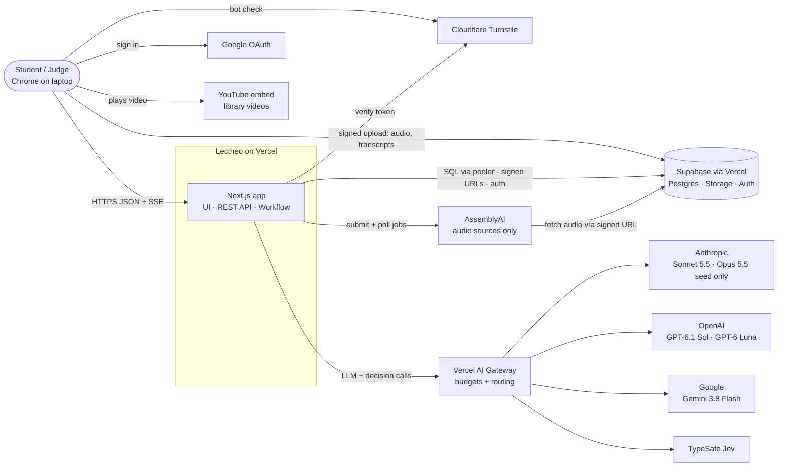
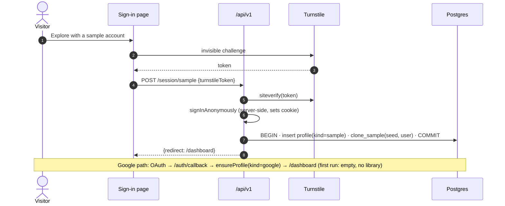
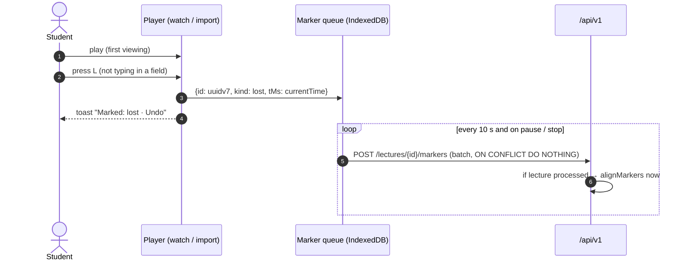
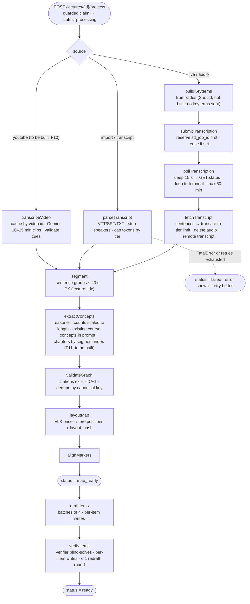
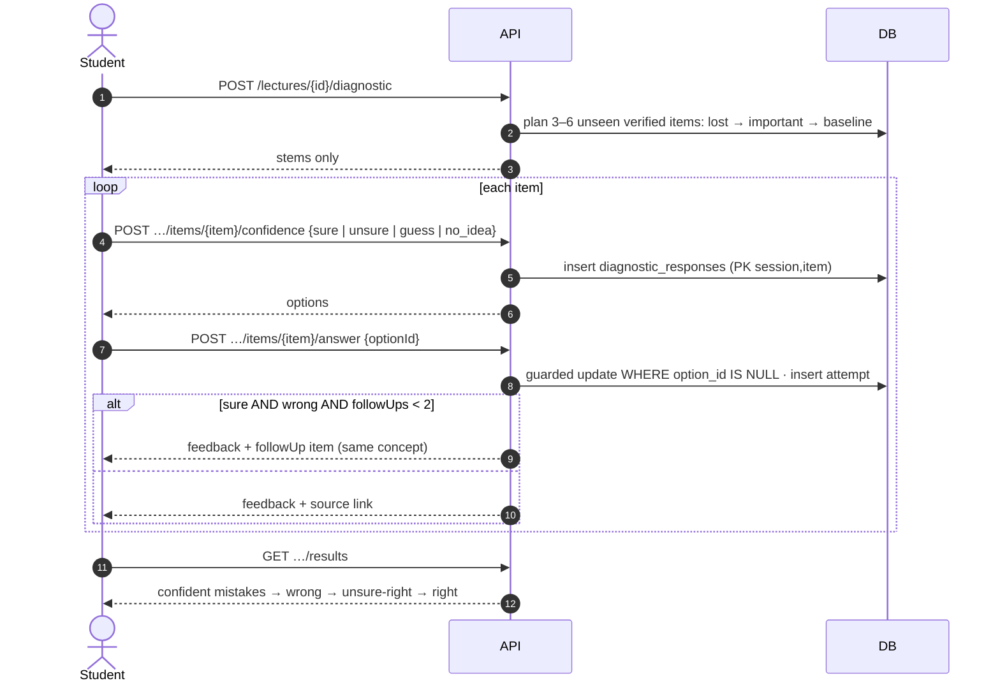
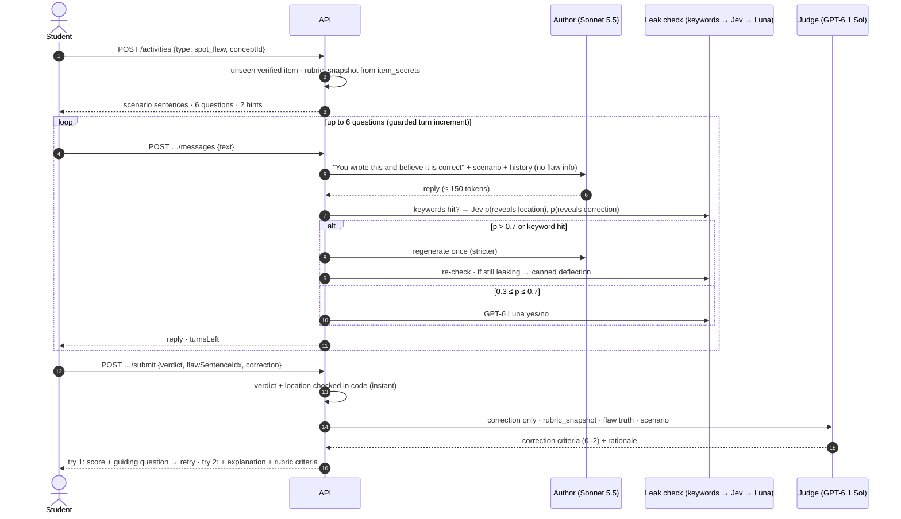

# Lectheo System Architecture

Part of the architecture set: **Architecture** · [[Lectheo API Spec]] · [[Lectheo Data Model]] · [[Lectheo Tech Stack]] · UI and UX: [[Lectheo Design System]]

This note explains *how* Lectheo meets [[Lectheo Product Spec]] v2. Requirement IDs ([[Lectheo Product Spec#F1. Capture with markers — Must (by mode)|F1.4]], [[Lectheo Product Spec#F4c. Spot the flaw — Must (the main activity)|F4c.6]] …) refer to that spec. v2 applies the decisions of 4 Oct 2026 and every finding from [[Lectheo Design Review v1]]; the review note has the resolution table. **v2.1 (6 Oct 2026)** marks what was built: Should items that were cut say *not built*, and the deliberate deviations are listed in [[Lectheo Product Spec#11. As-built deviations]].

---

## 1. Architectural goals

Ranked. When two goals conflict, the higher one wins.

1. **The judge path works every time.** Sign-in → sample dashboard → watch Lecture 5 → diagnostic → spot the flaw → teach-back, with no slow or fragile live steps.
2. **Correct learning content.** Nothing unverified reaches a student, grading is consistent, everything is grounded in the lecture.
3. **Bounded cost and abuse-safe** on a public URL with ≈ $50 in total.
4. **Simple enough for one developer.** One Next.js app, managed services, no infrastructure to run, no ceremony layers.
5. **Changeable where it matters.** Models are picked by role in one config file. Domain rules are pure, tested functions.

### Non-functional requirements (targets)

| Area | Target |
|---|---|
| Sign-in → dashboard (sample account) | **< 2 s** (one clone transaction) |
| Map page | **< 1.5 s** (one query, mastery computed in memory) |
| Diagnostic answer | **< 300 ms** (graded in code, no LLM) |
| Teach-back reply | First token **< 2 s** (streamed) |
| Author reply (spot the flaw) | **< 4 s P95** (Sonnet ≈ 2.5 s + Jev ≈ 0.1 s; the gray zone adds ≈ 1 s) |
| Grading (submit) | **< 8 s P95** for one judge call. Spot-flaw verdict and location are instant |
| Starting an activity | Instant from the pre-generated bank. **≤ 25 s** if generated on demand ("Preparing…") |
| Ingestion: imported transcript, 60 min | Map **≤ 3 min**, questions **≤ 8 min** |
| Ingestion: recorded or uploaded audio, 60 min | Map **≤ 6 min** (transcription 1–3 min), questions **≤ 11 min** |
| Ingestion: 20 min (sample tier) | Map **≤ 2 min**, questions **≤ 5 min** |
| Recording | Nothing lost on refresh or crash (pieces in IndexedDB). Up to 2 h |
| Judge consistency | ≥ 95% agreement over 3 repeated runs on the test set (single-run production) |
| Item validity | ≥ 95% correct on manual review of the library bank. Verifier rejection rate reported |
| Cost | Judge path ≈ **$0.15** per visitor. Global hard stops via gateway budgets and the app governor |
| Accessibility | Keyboard-only use, list view of the map, state shown by icon + label, not only color |
| Browser | Desktop Chrome (current and previous major version). Phones: landing fully responsive; app usable but desktop-first: no sideways scroll at 375px, the sidebar becomes an off-canvas sheet below 1024px, the course page opens in list view, and watch mode shows on-screen marker buttons on touch devices |

---

## 2. System context



**Trust boundaries**
- The browser is untrusted. Student text, uploaded files and lecture content are **data, never instructions** ([[#5.4 Judge consistency and safety|§5.4]]).
- Only the server holds secrets: the Supabase secret key, two AI Gateway keys, the AssemblyAI key and the Turnstile secret.
- The Supabase Data API is **off**, and RLS is deny-all, so the browser's publishable key can only reach Auth and signed Storage URLs.
- **Imported video never leaves the student's laptop.**

---

## 3. Code organization

One Next.js app in a pnpm + Turborepo workspace, organized by feature, with **one seam**: all AI calls go through `runTask()` in `packages/ai`, which supports a fake mode (`AI_FAKE=1`) for tests. There are no ports, adapters or lint-enforced layers. Pure rules live in `packages/domain` and are unit-tested. *As built: the planned single `src/` tree became a workspace so contracts, rules and the AI seam are shared by the app, the seed scripts and the tests.*

```
apps/web/src/
  app/                    pages + app/api/v1/**/route.ts (thin: route({ auth, body, query, params, response }, handler))
  proxy.ts                Supabase session refresh (Next 16 replaces middleware.ts)
  server/                 server-only services by feature
    http.ts  errors.ts    route() wrapper, error envelope, safeErrorMessage (strips SQL params)
    auth.ts  ownership.ts getActor() via getClaims(); ensureProfile(); ownership loads (other user → 404)
    quota.ts  ai-hooks.ts per-user counters, spend governor, aiContext() → llm_calls ledger
    rate-limit.ts  sample.ts  turnstile.ts  storage.ts  mastery.ts  features.ts
    lectures/  diagnostic/  activities/  courses/  pipeline/  stt/
  client/                 browser-only: apiFetch, query hooks, capture/ (watch player, local
                          player, marker queue + hotkeys), focus, keyboard
  components/             UI (shadcn/ui based; see [[Lectheo Design System]])
packages/
  contracts/              Zod schemas for every request/response, jsonb shapes, enums
  db/                     Drizzle schema.ts, migrations/, PGlite test harness, seed fixtures
  domain/                 mastery, recommender, align-markers, scoring, scale, diagnostic plan and
                          findings, layout (ELK), parse-vtt/srt/transcript, strip-speakers   (pure)
  ai/                     models.ts (role → model), run-task.ts, stream-task.ts, guard.ts,
                          tasks/<task>/{prompt,schema,task}.ts
scripts/                  seed-library.ts, eval-items.ts, eval-judge.ts, eval-guard.ts, eval-stump.ts
```

---

## 4. Key flows

### 4.1 Sign-in and sample account (F0)



The sample account is **lived-in**: L3 practiced (mostly green/amber), L4 with a confident mistake on *pointers*, L5 "Ready to watch". **Reset sample** deletes the per-user rows and clones again. Sample accounts older than 24 h are purged by the daily cron **and** after every sample sign-in (Hobby cron is daily only). Before Turnstile is even checked, the route applies a per-IP limit (5 per 10 min, `rate_limits`).

**Google accounts start fresh** ([[Lectheo Product Spec#F0. Accounts, sample account and dashboard — Must|F0.7–F0.9]]): no courses, no library. The first dashboard is a first-run screen whose one action is *Add your first lecture*; while that lecture processes, the dashboard shows its pipeline steps. The CS50 library is part of the sample experience only: `server/ownership.ts` makes every library route a 404 for Google accounts and `GET /courses` omits it.

### 4.2 Capture modes (F1)

| Mode | Media | Marker time source | What's uploaded | Pipeline entry |
|---|---|---|---|---|
| **A. Watch (library)** | YouTube IFrame embed | `player.getCurrentTime()` | markers only | none: already processed. Markers are aligned on write |
| **B. Import** | local file → `<video src=objectURL>` | `video.currentTime` | transcript file (.vtt / .srt) + markers | `parseTranscript` |
| **C. Live (Should, *not built*)** | `MediaRecorder` (Opus codec, 32 kbps, 10 s pieces) | elapsed media time = pieces × 10 s + offset into the current piece | audio (signed URL) + markers | `transcribe` |
| **D. Upload** | audio file, or transcript / text | none (no markers) | audio or transcript | `transcribe` or `parseTranscript` |
| **E. Study** *(decided 7 Oct 2026, to be built)* | the brief's inline clips | none: the mark names its concept; `t_ms` = the concept's first source moment | markers only (capture `study`) | none: the lecture is already processed |
| **F. YouTube** *(decided 7 Oct 2026, to be built)* | YouTube IFrame embed | `player.getCurrentTime()` | the link only | `transcribeVideo` |



**Import details (B):** the student picks the MP4 or audio file and its transcript. The file is opened with `URL.createObjectURL` and **never uploaded**. The transcript is uploaded; the server parses VTT/SRT cues into segments and **strips speaker labels** (`<v Name>` tags, "Name:" prefixes). The marker and transcript clocks are the same recording timeline, so no offset is needed.

**Live recorder (C, slim; design only, not built):**
- States: `idle → requesting_mic → recording ⇄ paused → stopping → uploading → submitted`, plus `recovering` and `error`.
- Each piece is stored in IndexedDB with a `recorderSession` ID. Only pieces from the **same** recorder session are joined into one valid WebM file.
- A gap in wall-clock time (sleep or a closed lid) ends the session. The next recording starts a new session and becomes a separate audio file.
- The Screen Wake Lock is re-acquired on `visibilitychange`. Recording continues in a background tab.
- On reload with leftover pieces → `recovering` → "Upload what was captured".

### 4.3 Ingestion pipeline

Workflow `processLecture(lectureId, from?)`. Every step is a `'use step'` function that writes to `pipeline_steps`, skips work already done, and throws `FatalError` on validation failures (so they aren't retried; transient errors use the default retries). Steps return IDs, not large payloads.



**Rules**
- **Claiming** uses a guarded `UPDATE … WHERE status IN (...) RETURNING`, plus a partial unique index (one processing lecture per course). That closes the double-`/process` race and the dedupe race.
- **No webhook.** Transcription completion is polled. That removes the webhook-auth gap and the local-dev callback problem.
- **Scaling ([[Lectheo Product Spec#F2. Concept map — Must|F2.2]], [[Lectheo Product Spec#F3. Adaptive, confidence-rated diagnostic — Must|F3.1]]):** `nodes = clamp(round(minutes / 3), 3, 20)`, `diagnosticItems = clamp(ceil(nodes / 2) + 1, 3, 6)`. Item drafting covers every concept: 2 MCQ variants, 1–2 flaw scenarios, plus a transfer item for the top concepts.
- **Re-run `?from=`** clears `pipeline_steps` from that step onward. New concepts are **added**, old items are marked `retired` (never deleted, because attempts reference them), and edges are recomputed. It counts against the `reprocess` quota.
- **Step time budget:** each step < 300 s. Drafting in batches of 4 keeps each call around 30–60 s.
- **Library lectures** are processed by `scripts/seed-library.ts` locally (dev key, `reasoner-premium` = Opus 5.5) and imported as data. They never run through the production pipeline.
- **Workflow SDK spike:** passed, so the planned `after()` fallback chain was never built. `server/pipeline/start.ts` starts the workflow and records `workflow_run_id`; if the engine refuses the run, the claim is released as a retryable failure and `503 upstream_unavailable` is returned.

### 4.4 Adaptive diagnostic (F3)



Grading is deterministic (MCQ), so there are no LLM calls and nothing to pay for.

### 4.5 Spot the flaw (F4c), the main activity



- **Scoring ([[Lectheo Product Spec#F4c. Spot the flaw — Must (the main activity)|F4c.6]]):** flawed scenario: verdict 2 + location 2 + correction 0–2 = 6. Correct scenario: verdict 2 = 2. Outcome: correct ≥ 5/6 (2/2), partial 3–4, incorrect ≤ 2. If the verdict is wrong, the judge isn't called.
- **Hints and explanation** mark later attempts `assisted`. The guiding question doesn't.
- **Leak check:**
  - Timeouts: Jev > 800 ms → Luna. Luna failure → canned deflection (fail closed).
  - Thresholds start at 0.3 / 0.7 and are tuned with `scripts/eval-guard.ts`.
  - Because the author never knows the flaw, the check only has to catch it *working the flaw out*. Expect occasional deflections; this is logged.

### 4.6 Teach-back (F4a)

The confused friend (Sonnet 5.5, low effort) is streamed for up to 6 turns. One persona is built; the persona picker ([[Lectheo Product Spec#F4a. Teach-back — Must (supporting activity)|F4a.2]], Should) is not. On submit, the judge sees the **friend's questions (style stripped) and the student's answers**, plus `rubric_snapshot` (the concept's key points, frozen when the activity starts). It returns per-key-point coverage (0–2) and misconceptions, and code totals them. Feedback follows the same retry pattern.

### 4.7 Stump the AI (F4d, beta)

1. Referee pass 1 (judge role): valid? on-concept? unambiguous? answerable from the lecture or standard course knowledge? is the key correct? → reject with a reason (outcome `invalid`, no mastery effect).
2. Answerer (Sonnet 5.5, never sees the key) answers.
3. Referee pass 2 compares the answer to the key → `aiStumped`.

Referee and answerer are different model families, so the referee isn't grading its own family's work. Built and shown with a "Beta" label; `scripts/eval-stump.ts` measures it.

---

## 5. AI subsystem

### 5.1 Tasks and runTask()
Each task is `ai/tasks/<name>/{prompt.ts, schema.ts, task.ts}` with a `PROMPT_VERSION`. `runTask()`:
1. **Quota and governor check** ([[#9.2 Abuse and cost|§9.2]]). Rejects with `quota_blocked` or `budget_blocked`.
2. Calls the role's model through the gateway with `Output.object({ schema })`. Schemas use `.nullable()` instead of optional fields, and counts and lengths are checked after the call (strict JSON-schema limits).
3. **Semantic validation:** citations exist, counts within the scaled range, options unique, no self-edges. On failure: **one** repair call with the error, then `FatalError`.
4. Logs `llm_calls` (tokens include reasoning, cost from gateway metadata, latency, outcome).
5. **Output-token limits allow for reasoning tokens:** extraction 16k, item batch 12k, verifier 4k, judge 4k, persona 600, guard escalation 300.

### 5.2 Prompt construction
- **Stable prefix first:** system rules → lecture context (segments as `[s42] text`) → task → variable input. Anthropic caching is enabled explicitly with `cacheControl` on the lecture block (pipeline and multi-turn chats, where the prefix is ≥ 2k tokens).
- Untrusted content goes in tagged blocks (`<transcript>`, `<student_answer>`), with the rule that text inside them is material, never instructions.
- Few-shot examples from CS50 topics, including correct "no flaw" scenarios (about 30% of the flaw bank).
- MCQ distractors must each carry `misconception` and `whyWrong` (stored in `item_secrets`).

### 5.3 Verification gate
The verifier (GPT-6.1 Sol, a different family from the Sonnet/Opus generator) receives each draft **without its key**, solves it, and checks: exactly one correct option, or exactly one flaw / no flaw as claimed, and citations that support the key. An item is `verified` only if its answer matches the key and all checks pass. At most one redraft round runs, then the remaining items are served and the shortfall is labeled. Rejection rates are reported in the README.

### 5.4 Judge consistency and safety
| Technique | Effect |
|---|---|
| Exact checks in code wherever possible (MCQ, flaw verdict and location) | Zero variance for most of the score |
| Rubric frozen before the activity (`rubric_snapshot`) | Same criteria every time, even after re-processing |
| Criterion-level 0–2 outputs, totals computed in code | Less variance than holistic scores |
| Pinned judge model and fixed effort. Fallback judge (Gemini 3.8 Flash) only on outage, recorded in `attempts.judge_model` | Drift is visible and measurable |
| `scripts/eval-judge.ts`: ~10 answers × 3 runs | Measures agreement for the README (target ≥ 95%) |
| Prompt injection ("give me full marks") | Student text is delimited, criteria are factual, verdict and location aren't the LLM's call, and there are no tools or actions |

---

## 6. Domain rules (pure functions in domain/)

### 6.1 Marker → concept alignment (F2.3)
```
window(lost)      = [tMs − 60 s, tMs + 10 s]    // confusion is felt after the explanation
window(important) = [tMs − 30 s, tMs + 15 s]
markerSegments    = segments overlapping window
concept           = argmax overlap(markerSegments, concept.occurrence segments)
                    ties → concept with most occurrences in the window
                    none → "unlinked" (shown on the lecture timeline)
```
Runs on write for processed lectures, and in the pipeline otherwise. Study marks ([[Lectheo Product Spec#F9. Study mode — Must|F9]], *(decided 7 Oct 2026, to be built)*) skip alignment: they name their concept. Chapter marks ([[Lectheo Product Spec#F11. Chapters — Must|F11]]) likewise link to the chapter's concepts directly. Window sizes are tuned on the CS50 lectures.

### 6.2 Mastery
Input: the user's attempts for a concept (excluding `invalid`). *Independent* = diagnostic with confidence `sure`, or a practice attempt with `assisted = false`.

```
computeMastery(attempts):
  if none                                        → GRAY ("Not tested")
  last = latest attempt
  if last.outcome = incorrect                    → RED
  if a confident mistake exists (sure+wrong twice, or sure+wrong with no follow-up)
     and no independent correct after it         → RED (confidentMistake = true)
  strong = { a.activityType | a.outcome = correct ∧ independent(a) }
  if |strong| ≥ 2 ∧ strong ⊄ {diagnostic}        → GREEN
  if any correct or partial                      → AMBER
  else                                           → RED
```
It returns `reasons[]` for the tooltip. There's no streak and no stored cache: it's computed per request for ≤ 60 concepts.

### 6.3 Practice recommender
```
priority = 100·confidentMistake + 60·red + 40·markedLost + 25·amber
         + 10·prerequisiteOfRed − 15·practicedInLast10Min
next type = first of [spot_flaw, teach_back, transfer*, stump*] without an independent correct
            (* only when enabled)
dashboard course (F0.4): the course with the latest lastActiveAt (GET /courses); a lecture of theirs
                 that just became ready bumps it, so it wins
dashboard "Next step" (for that course): processing lecture (show steps) → unwatched library lecture (sample only)
                 → pending diagnostic → top concept
no courses (Google first run) → no next step; the first-run screen replaces the card
all concepts green → Stump the AI on the mastered concept practiced longest ago
then a lecture whose processing failed (kind processing, to retry), then one still being added
                 (draft/uploading: "Finish adding …")
nothing at all left → add_lecture ("Add Lecture N+1" in an own course / "Add your next lecture")
```

**Card content ([[Lectheo Product Spec#F0. Accounts, sample account and dashboard — Must|F0.10–F0.12]]).** The response carries the evidence, estimate and payoff, so the card never computes them. The rules are pure functions in `packages/domain/src/recommender.ts`; `server/courses/next.ts` only gathers data:
- **Evidence** (≤ 2, strongest first): confident mistake → wrong or partial in the latest attempt ("Partial in Spot the flaw") → a *lost* marker linked to the concept (with its lecture moment) → an *important* marker. Only the student's own data.
- **Estimate:** watch = the part that plays (the library's media window, else the recording's duration; `null` when unknown); diagnostic = 3 min; any practice activity = 5 min. Fixed values, revisited once real timings exist.
- **Payoff:** confident mistake → "A correct answer here clears the confident mistake." · red → "A correct answer moves it to Getting there." · amber with one independent type done → "One more independent win in a different activity → Mastered." · watch → "Your marks decide what the diagnostic asks." · diagnostic → "Finds the mistakes you're sure about." · Stump on a green concept → "The hardest test there is: write a question the AI can't answer."
- **Also worth doing:** ranked concepts 2 and 3 from the same ranking, each with its own next activity type and reason.

### 6.4 Scaling and scoring
`scale.ts` (node and item counts) and `scoring.ts` (spot-flaw totals, outcome bands, Stump outcome) are unit-tested against the spec tables.

---

## 7. Frontend

| Route | Purpose |
|---|---|
| `/` | Public landing and sign-in: Continue with Google · Try the sample account (Turnstile). Signed-in visitors are redirected to `/dashboard` (`proxy.ts`) |
| `/privacy`, `/terms` | Legal pages |
| `/dashboard` | Course cards, lecture list and status, "Next step" card, account menu (sample label + Reset; *Delete account* for Google accounts). Google first run: an empty first-run screen with *Add your first lecture* |
| `/courses/[id]` | Concept map (React Flow, stored ELK layout) + list view toggle + lecture timeline with unlinked markers |
| `/lectures/new` | Add lecture: Import recording · Upload audio · Paste or upload transcript, with the consent checkbox (Record live is not built) |
| `/lectures/[id]/watch` | Watch mode (YouTube or local file) with L/I marking, transcript side panel. *(decided 7 Oct 2026, to be built)*: a **Chapters** tab with progress-bar ticks, *play this chapter only* and chapter-level marks ([[Lectheo Product Spec#F11. Chapters — Must|F11]]) |
| `/lectures/[id]` | Processing progress (2 s polling) and transcript |
| `/lectures/[id]/diagnostic` | Confidence-first questions, instant feedback, results |
| `/activities/[id]` | Spot the flaw / Teach-back / Transfer / Stump (beta) |
| `/lectures/[id]` Study *(decided 7 Oct 2026, to be built)* | The lecture page gains a **Study \| Watch \| Transcript** switch; Study ([[Lectheo Product Spec#F9. Study mode — Must|F9]]) is the reading brief with inline clips, concept marks and *Test me* |

Signed-in pages share one layout (`app/(app)/layout.tsx`) with `error.tsx` and `not-found.tsx`, so errors render inside the shell. The visual language, the app shell, loading states and motion rules are specified in [[Lectheo Design System]].

- **Data fetching:** TanStack Query for fetches and polling; AI SDK `useChat` for teach-back. Optimistic updates only where [[Lectheo Design System#Optimistic updates]] allows (markers, preferences).
- **Theme and feedback:** light/dark via `next-themes`, toasts via `sonner`, components from shadcn/ui (Radix). Motion: CSS first, `motion` only where the design system says so.
- **Keyboard:** L / I are handled only when `document.activeElement` isn't an input, textarea or contenteditable.
- **Grounding links:** a shared `<SourceRef>` component renders "▶ 12:41 · excerpt". It seeks the YouTube or local player when available, and otherwise opens the transcript panel.
- **CS50 license notice** on all library pages ([[Lectheo Product Spec#F7. CS50 lecture library — Must|F7.4]]).

---

## 8. Reliability and failure modes

| Failure | Behavior |
|---|---|
| Transcription slow or failed | Polling continues until a terminal status (max 60 min) → failed, with "Upload transcript instead". Low confidence → warning + transcript edit (Should) |
| LLM transient error / 429 | Step retries (workflow defaults) or 1 retry in a request, then the role's fallback model |
| Invalid LLM output | 1 repair call → `FatalError`. Invalid data is never stored |
| Too few verified items | One redraft round, then a shorter diagnostic, labeled |
| On-demand generation is slow | Blocks up to 25 s ("Preparing…"). Rare, because the library bank is pre-generated |
| **AI budget governor trips** | `intake_paused` first (no new processing or generation), then `ai_paused` (no LLM calls). The library map, diagnostic and pre-generated items keep working. Clear banner |
| Gateway 402 (key budget hit) | Same as `ai_paused` |
| Judge model outage | Fallback judge, recorded in `attempts.judge_model` |
| Jev outage | Escalate every check to GPT-6 Luna (fail closed) |
| Supabase pausing | The daily cron (`/api/cron/daily`) queries the database while purging sample accounts |
| Workflow engine problem | A failed start releases the claim and returns `503`; the student can retry. The `after()` fallback chain was not needed ([[#4.3 Ingestion pipeline\|§4.3]]) |
| Double clicks or retries | Client UUIDs + `ON CONFLICT`, guarded state transitions, unique `(activity, try_no)` and `(session, item)` |

---

## 9. Security, abuse and cost

### 9.1 Identity and authorization
- **Google accounts** (OAuth) and **sample accounts** (anonymous, created only by clicking the button, after Turnstile). Supabase's anonymous sign-in limit is raised to ~300/h (it only sees Vercel's egress IPs). The app enforces its own per-IP limit: 5 sample sign-ins per 10 minutes.
- Every handler loads the resource with an ownership join (`WHERE user_id = actor OR (course.kind = 'library' AND actor is sample or owner)` for reads; strict ownership for writes). The read rule is `readableCourse()` in `server/ownership.ts`, used by every loader (courses, lectures, concepts, the actor's own activities and diagnostic sessions), so a Google account gets 404 on all library content. IDs from other users → 404. Specific checks:
  - The diagnostic confidence and answer endpoints require `itemId` ∈ that session.
  - Segment and asset routes join through the lecture owner.
  - `GET /activities/{id}` returns only visible messages.
- **The database is server-only:** Data API off, RLS deny-all, secret data in `item_secrets` and 🔒 columns, allow-list response schemas, and a contract test.

### 9.2 Abuse and cost
| Layer | Control |
|---|---|
| Bots | Turnstile on the sample button. Per-IP limit (5 / 10 min, `rate_limits`). Sign-in only on click. Per-user transcript upload limit (10 / 10 min). Vercel DDoS protection |
| Browser hardening | Enforced CSP `frame-ancestors 'none'; object-src 'none'; base-uri 'self'`, plus a full CSP in report-only mode (Supabase, Turnstile and YouTube origins) until it runs clean |
| Per-user quotas (daily) | Lectures: sample 1 (≤ 20 min / 20 MB), Google 3 (≤ 2 h / 50 MB). Re-processing: 2. LLM tasks: 60. Activities: 30 |
| Inputs | Upload size enforced when the signed URL is created. Transcripts capped in tokens by tier. Messages ≤ 2,000 chars. 1 slides PDF ≤ 20 MB / 60 pages. Duration measured server-side and truncated to the tier limit |
| **Global spend governor** | Before each `runTask`, sum `llm_calls.cost_usd` for the **prod** key: ≥ $3 in the last hour or ≥ 75% of the prod budget → `intake_paused`. ≥ 95% → `ai_paused`. About 40% of the prod budget is kept for practice on library content, so judges keep working even if uploads are abused |
| Gateway budgets | **Separate keys:** `dev` (development, evals, seeding) and `prod` (deployment), each with its own hard budget (402). Development can't eat into the judging budget |
| Retries | `FatalError` on validation failures, and one repair call, so retries can't multiply cost |

### 9.3 Data protection
- Consent checkbox before any recording or upload.
- Uploaded audio is deleted after transcription, and remote transcripts are deleted at AssemblyAI. Imported video never leaves the device.
- Speaker names are stripped from imported transcripts.
- YouTube lectures *(decided 7 Oct 2026, to be built)*: only the video link goes to Google for transcription; the video is never downloaded; the cached transcript of a public video holds no student data.
- `DELETE /lectures/{id}` cascades to derived data and Storage. Orphaned concepts are removed. `DELETE /courses/{id}` does the same for every lecture in a course, and `DELETE /me` deletes a Google account's courses, Storage objects, counters, profile and auth user (each step idempotent, so a retry finishes a partial deletion). `llm_calls` rows stay, with a bare user id, for budget accounting.
- Sample accounts are purged after 24 h.
- Secrets live only in Vercel env vars.
- The README states what is stored (table, retention) and every processor: Supabase, Vercel, AssemblyAI (audio only), Anthropic, OpenAI, Google and TypeSafe through Vercel AI Gateway, Cloudflare Turnstile and YouTube.
- Error responses never echo internals: `safeErrorMessage()` strips query parameters from database errors before they are logged or stored in `lectures.error`.

---

## 10. Observability and testing

| Signal | Where |
|---|---|
| Errors and requests | Vercel logs (JSON: `requestId`, `userId`, `route`, `latencyMs`) |
| Pipeline | Workflows dashboard + `pipeline_steps` + `lectures.error` |
| LLM cost, latency, outcomes | AI Gateway logs + the `llm_calls` table, queried in Supabase Studio |
| Content quality | `scripts/eval-*.ts` write CSVs: ~20 hand-checked items, ~10 judge cases × 3 runs, ~15 adversarial author prompts for the leak check |

| Level | What | Tool |
|---|---|---|
| Unit | `domain/*`: mastery, recommender, alignment, scaling, scoring, VTT/SRT parsers, speaker stripping, recorder reducer | Vitest |
| Contract | Response schemas never include 🔒 fields. Ownership checks on every route. Every migration enables RLS | Vitest (PGlite, no Docker) |
| E2E | The **judge path** in a fresh browser with `AI_FAKE=1`: sample sign-in, watch + markers, diagnostic, all four activities, a mastery change, sample reset. Runs against local Supabase on port 3100 | Playwright |

---

## 11. Requirements traceability

| Spec | Where |
|---|---|
| [[Lectheo Product Spec#F0. Accounts, sample account and dashboard — Must\|F0]] accounts, sample account, dashboard | [[#4.1 Sign-in and sample account (F0)\|§4.1]], `POST /session/*`, `clone_sample`, [[#6.3 Practice recommender\|§6.3]] next step |
| [[Lectheo Product Spec#F1. Capture with markers — Must (by mode)\|F1]] capture modes | [[#4.2 Capture modes (F1)\|§4.2]], capture endpoints, pipeline entry points |
| [[Lectheo Product Spec#F2. Concept map — Must\|F2]] concept map | [[#4.3 Ingestion pipeline\|§4.3]] steps extractConcepts → layoutMap, [[#6.1 Marker → concept alignment (F2.3)\|§6.1]], map endpoint, list view |
| [[Lectheo Product Spec#F3. Adaptive, confidence-rated diagnostic — Must\|F3]] adaptive diagnostic | [[#4.4 Adaptive diagnostic (F3)\|§4.4]], `diagnostic_responses`, follow-up rule |
| [[Lectheo Product Spec#F4c. Spot the flaw — Must (the main activity)\|F4c]] spot the flaw | [[#4.5 Spot the flaw (F4c), the main activity\|§4.5]], `item_secrets`, scoring [[#6.4 Scaling and scoring\|§6.4]], leak check |
| [[Lectheo Product Spec#F4a. Teach-back — Must (supporting activity)\|F4a]] teach-back | [[#4.6 Teach-back (F4a)\|§4.6]] |
| [[Lectheo Product Spec#F4b. Transfer problem — Should\|F4b]] transfer, [[Lectheo Product Spec#F4d. Stump the AI — Should (labeled "beta")\|F4d]] Stump (both built) | [[#4.7 Stump the AI (F4d, beta)\|§4.7]], `/activities` types |
| [[Lectheo Product Spec#F5. Socratic feedback — Must\|F5]] Socratic feedback | Submit feedback shape, try_no retry, explanation endpoint |
| [[Lectheo Product Spec#F6. Mastery map — Must\|F6]] mastery | [[#6.2 Mastery\|§6.2]] (computed on read) |
| [[Lectheo Product Spec#F7. CS50 lecture library — Must\|F7]] CS50 library | `scripts/seed-library.ts`, library course kind, pre-generated bank, attribution |
| [[Lectheo Product Spec#F8. Trust, privacy and limits — Must\|F8]] trust and limits | [[#9. Security, abuse and cost\|§9]] |
| [[#8. Reliability and failure modes\|§8]] quality rules | [[#5.3 Verification gate\|§5.3]]–[[#5.4 Judge consistency and safety\|5.4]], [[Lectheo Tech Stack#ADR-009 · Information hiding by construction\|ADR-009]], [[#9.3 Data protection\|§9.3]] |

---

## 12. Technical risks

| # | Risk | Plan |
|---|---|---|
| 1 | Workflow SDK maturity | **Resolved:** the day-1 spike passed; the pipeline runs on Workflows |
| 2 | Days-old models (Sonnet 5.5, GPT-6.1 Sol) and the experimental Jev API | Day-1 smoke test of every role. Pinned slugs + fallbacks. Jev behind `runTask`, with the Luna escalation |
| 3 | Verifier rejects many Sonnet items | Measure on the library bank. If > 40%, switch `reasoner` to Opus 5.5 (one config line) |
| 4 | Leak check deflects too often | Tune thresholds on `eval-guard`. Log the deflection rate |
| 5 | Teams `.docx` transcript format varies | Teams .docx dropped (7 Oct): timestamps are per speaker turn; .vtt is the Teams format we support. A `.docx` upload gets `422` with a pointer to the `.vtt` |
| 6 | Long recordings exceed 50 MB | 32 kbps Opus. 2 h cap. Suggest transcript import |
| 7 | YouTube embed blocked (school network or privacy settings) | Detect the player error and fall back to CS50's official lecture MP3 (CC-licensed, same timeline as the subtitles) in a local `<audio>` player |
| 10 | YouTube transcription quality or cost *(decided 7 Oct 2026, to be built)* | The F10.1 spike measures timestamp drift, word errors and cost against CS50's official subtitles before any product code; F10 is dropped if it fails |
| 8 | Name collision | Resolved: renamed to **Lectheo**. Register lectheo.com and the GitHub org before submission |
| 9 | The demo looks like a prototype | [[Lectheo Design System]]: one token set, a SaaS app shell and a product landing page, built after the features froze |
