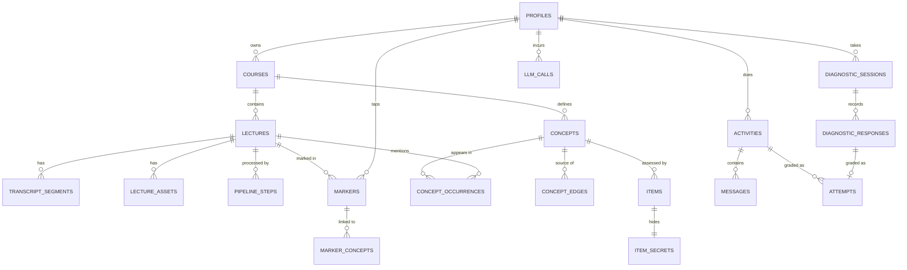

# Lectheo Data Model

Part of the architecture set: [[Lectheo Architecture]] · [[Lectheo API Spec]] · **Data Model** · [[Lectheo Tech Stack]]

Postgres (Supabase, provisioned through Vercel), managed with Drizzle migrations. The executable form is `packages/db/src/schema.ts`; migrations live in `packages/db/migrations/` (`0000_init` → `0004_rate_limits`).

**Conventions**
- **Primary keys:** `uuid` **v7 generated in the app** (Drizzle `$defaultFn`; Postgres 17 has no built-in v7). The client generates IDs for markers and created resources, and inserts use `ON CONFLICT DO NOTHING`, so retries are safe without an idempotency table.
- **Times:** timestamps are `timestamptz` (UTC). Times inside a lecture are integer **ms of media time** (position in the recording or video).
- **JSON:** every `jsonb` column is validated by the same Zod schema the app uses.
- **Access:** **RLS is enabled on every table with no policies (deny-all)**, and the Supabase Data API is turned off for the `public` schema. Only the Next.js server reads or writes data, using the privileged connection. Authorization happens **in app code**. The browser uses Supabase only for Auth (Google + anonymous) and signed Storage uploads. As defense in depth, the Data API roles (`anon`, `authenticated`) have no table privileges and can't execute the sample functions (`0004`). Every new table enables RLS in its migration (a migrations test fails otherwise).
- **Server-only data:** answer keys, rubrics, hints and leak keywords live in **separate secret tables or columns** (🔒) that no client response schema includes. A contract test enforces this.
- **Indexes:** every foreign-key column used for lookups has an index (Postgres doesn't create them automatically).

**Changed from v1:** removed `evidence`, `concept_mastery` (mastery is now computed on read), `idempotency_keys`, `conversations` (now `activities`), `app_flags.require_stump_for_green`, and photo assets. Added `item_secrets`, `diagnostic_responses`, `pipeline_steps`, `attempts.try_no`, and sample-account support.

---

## 1. Entity-relationship diagram

---

## 2. Tables

### Identity

**`profiles`**: 1:1 with `auth.users`. Created lazily by the server auth helper on the first request (no database trigger).

| Column         | Type                                     | Notes                                                            |
| -------------- | ---------------------------------------- | ---------------------------------------------------------------- |
| `id`           | uuid PK                                  | = `auth.users.id`                                                |
| `kind`         | enum `google`, `sample`, `seed`, `owner` | `seed` = the template student for sample accounts. `owner` = you |
| `display_name` | text null                                | from Google, or "Sample student"                                 |
| `seeded_from`  | uuid null                                | for `sample`: the seed profile it was copied from                |
| `timezone`     | text default `'UTC'`                     |                                                                  |
| `created_at`   | timestamptz                              | used by the 24 h purge of `sample` accounts                      |

### Courses and lectures

**`courses`**

| Column | Type | Notes |
|---|---|---|
| `id` | uuid PK | |
| `owner_id` | uuid FK → profiles ON DELETE CASCADE, **null for library courses** | `CHECK ((kind = 'library') = (owner_id IS NULL))` |
| `kind` | enum `library`, `personal` | library = readable by sample and owner accounts only, writable by no one at runtime; Google accounts start fresh |
| `title` | text | e.g. "CS50x 2026" |
| `attribution` | jsonb null | library license notice: `{source, license, url, adaptedBy}` |
| `layout` | jsonb null | ELK node positions `{conceptId: {x, y}}` |
| `layout_hash` | text null | hash of concept + edge IDs; recompute layout when it changes |
| `created_at` | timestamptz | |

Index: `(owner_id)`.

**`lectures`**

| Column | Type | Notes |
|---|---|---|
| `id` | uuid PK | client-generated |
| `course_id` | uuid FK → courses ON DELETE CASCADE | |
| `title` | text | |
| `seq` | int | order within course |
| `source` | enum | `library`, `import`, `live`, `audio`, `transcript`, `youtube` ([[Lectheo Product Spec#F10. YouTube lectures — Should (after a spike)|F10]], migration `0007`) |
| `status` | enum | `draft` → `uploading` → `processing` → `map_ready` → `ready`, or `failed` |
| `progress` | jsonb | `{step, done, total}` for the polling UI |
| `media` | jsonb null | library: `{youtubeId, startMs, endMs}`. Import: `{localFileName, durationMs}` (metadata only; the file stays on the device). YouTube: `{youtubeId, durationMs}` (only the 11-character id; the link itself isn't stored) |
| `has_timestamps` | bool | false for plain-text transcripts, which disables markers |
| `audio_path` | text null | Storage path for uploaded or recorded audio. **Cleared, and the object deleted, after transcription** |
| `duration_ms` | int null | measured: from the transcription result or the last transcript cue |
| `stt_job_id` | text null | written **before** the transcription job is submitted, so retries don't create duplicate jobs |
| `stt_confidence` | real null | |
| `workflow_run_id` | text null | |
| `needs_reprocess` | bool default false | set after a transcript edit |
| `error` | jsonb null | `{step, code, message}` |
| `chapters` | jsonb null | ([[Lectheo Product Spec#F11. Chapters — Must|F11]]): `[{ id, title, summary, startIdx, endIdx, conceptIds[] }]` (contracts `Chapters`), ids `ch1…` in order, segment indexes, not times (times are read from `transcript_segments`; `endIdx` is inclusive). Written by `validateGraph` from the `extractConcepts` output once checked (an invalid list is dropped); replaced on re-process and cleared when the transcript is replaced. `null` for lectures without timestamps. Library lectures get theirs from the seed fixture (`fixtures/chapters.ts`) |
| `created_at`, `updated_at` | timestamptz | |

Index: `(course_id, seq)`. The **"one processing lecture per course"** rule is a partial unique index: `UNIQUE (course_id) WHERE status = 'processing'`.

**`transcript_segments`**

| Column | Type | Notes |
|---|---|---|
| `lecture_id` | uuid FK ON DELETE CASCADE | **PK part** |
| `idx` | int | **PK part**. Prompts cite segments as `[s42]`; the server maps them back to `(lecture_id, 42)` |
| `start_ms`, `end_ms` | int | `0, 0` when there are no timestamps |
| `text` | text | speaker names stripped |
| `edited_text` | text null | student correction (Should) |

Edits never re-segment, so citations stay stable.

**`lecture_assets`** (Should: slides PDF and typed notes). *As built: the table exists, but nothing writes it yet (slides input is not built).*

| Column | Type | Notes |
|---|---|---|
| `id` | uuid PK | |
| `lecture_id` | uuid FK ON DELETE CASCADE | |
| `kind` | enum `slides_pdf`, `notes_text` | max 1 slides PDF per lecture |
| `storage_path` | text null | |
| `extracted_text` | text null | |
| `status` | enum `pending`, `extracted`, `failed` | |

**`pipeline_steps`**: per-step state for the ingestion workflow, which makes the steps idempotent.

| Column | Type | Notes |
|---|---|---|
| `lecture_id` | uuid FK ON DELETE CASCADE | PK part |
| `step` | text | PK part. One shared enum (see [[Lectheo Architecture#4.3 Ingestion pipeline]]) |
| `status` | enum `pending`, `running`, `done`, `failed` | |
| `attempts` | int | |
| `output` | jsonb null | small results and IDs only, never transcripts |
| `updated_at` | timestamptz | |

**`markers`**: per user, so different users can mark the same library lecture.

| Column | Type | Notes |
|---|---|---|
| `id` | uuid PK | **client-generated**. A batch upsert with `ON CONFLICT DO NOTHING` is idempotent |
| `lecture_id` | uuid FK ON DELETE CASCADE | |
| `user_id` | uuid FK → profiles ON DELETE CASCADE | |
| `kind` | enum `lost`, `important` | |
| `t_ms` | int | media time |
| `capture` | enum `watch`, `live`, `study` | `study` ([[Lectheo Product Spec#F9. Study mode — Must|F9]]), a mark made on a concept in the brief; linked to that concept directly (`marker_concepts.overlap_score = 1`), `t_ms` = the concept's first source moment. Chapter marks ([[Lectheo Product Spec#F11. Chapters — Must|F11]]) use the same capture: `t_ms` = the chapter's start, linked to every concept the chapter covers |
| `target` | jsonb null | Study marks only: `{ conceptId }` or `{ chapterId }` (contracts `StudyTarget`), what was marked. A pipeline re-run re-links study marks by it instead of by time (the chapter id follows the chapter that now starts at `t_ms`). `null` for watch and live markers |
| `deleted_at` | timestamptz null | undo within 5 s (soft delete) |
| `created_at` | timestamptz | |

Index: `(lecture_id, user_id)`.

**`marker_concepts`**

| Column | Type | Notes |
|---|---|---|
| `marker_id` | uuid FK ON DELETE CASCADE | PK part |
| `concept_id` | uuid FK ON DELETE CASCADE | PK part |
| `overlap_score` | real | computed by the alignment rule |

Index: `(concept_id)`.

### Concept graph (per course)

**`concepts`**

| Column | Type | Notes |
|---|---|---|
| `id` | uuid PK | |
| `course_id` | uuid FK ON DELETE CASCADE | |
| `name` | text | |
| `canonical_key` | text | normalized name. `UNIQUE (course_id, canonical_key)` |
| `summary` | text | one grounded sentence |
| `key_points` | jsonb | 2–5 points with segment citations. The source for teach-back rubrics. **Not secret** since 7 Oct 2026: shown in the Study brief (`GET /lectures/{id}/brief` only; [[Lectheo Product Spec#F9. Study mode — Must|F9]], ADR-009 amended); still frozen into `rubric_snapshot` for teach-back |
| `depth` | jsonb null | *(decided 7 Oct 2026, to be built)* ([[Lectheo Product Spec#F9. Study mode — Must|F9.13]]): `{ howItWorks: [{ text, cites: [idx] }], example: { text, code?, beyondLecture } \| null, mistakes: [{ mistake, why }] }`, citations are segment indexes of `first_lecture_id`. Written by the pipeline's `explainConcepts` step (in parallel with item drafting) for concepts this lecture introduces; never overwritten by a later lecture; replaced on re-process. `null` until written or if the step failed. Not secret; shown only in the Study brief. Never derived from `item_secrets` |
| `first_lecture_id` | uuid FK ON DELETE SET NULL | |

Index: `(course_id)`.

**`concept_occurrences`**

| Column | Type | Notes |
|---|---|---|
| `concept_id` | uuid FK ON DELETE CASCADE | PK part |
| `lecture_id` | uuid FK ON DELETE CASCADE | PK part |
| `segment_idxs` | int[] | grounding (validated in code; arrays can't carry FKs) |
| `salience` | real | 0–1 |

Index: `(lecture_id)`.

**`concept_edges`**

| Column | Type | Notes |
|---|---|---|
| `id` | uuid PK | |
| `course_id` | uuid FK ON DELETE CASCADE | |
| `from_concept_id`, `to_concept_id` | uuid FK ON DELETE CASCADE | `CHECK (from_concept_id <> to_concept_id)` |
| `relation` | enum | `depends_on`, `is_a`, `part_of`, `contrasts_with`, `causes`, `example_of` |
| `lecture_id` | uuid FK ON DELETE SET NULL | where the edge was first stated |
| `segment_idxs` | int[] | grounding |

`UNIQUE (from_concept_id, to_concept_id, relation)`. `depends_on` edges must form a DAG (checked in the pipeline's validateGraph step).

After a lecture is deleted, concepts left with **no occurrences** are deleted in code (a foreign key can't express this).

### Assessment content

**`items`**

| Column | Type | Notes |
|---|---|---|
| `id` | uuid PK | |
| `concept_id` | uuid FK ON DELETE CASCADE | |
| `lecture_id` | uuid FK ON DELETE CASCADE | |
| `kind` | enum | `diagnostic_mcq`, `spot_flaw`, `transfer` |
| `variant` | int | 1, 2, … for the "never serve the same item twice" rule |
| `status` | enum | `draft`, `verified`, `rejected`, **`retired`** (replaced by a re-process, but kept because attempts reference it) |
| `public_payload` | jsonb | the only part clients see: stem + options (MCQ), sentences (flaw), prompt (transfer) |
| `segment_idxs` | int[] | grounding |
| `verification` | jsonb | verifier verdict and reasons |
| `prompt_version`, `model` | text | provenance |
| `created_at` | timestamptz | |

Index: `(concept_id, kind, status)`, `(lecture_id)`.

**`item_secrets`** 🔒: separate table for defense in depth.

| Column | Type | Notes |
|---|---|---|
| `item_id` | uuid PK FK → items ON DELETE CASCADE | |
| `answer_key` | jsonb | MCQ: `{correctOptionId, explanation}`. Flaw: `{hasFlaw, flawSentenceIdx, flawSummary, correction, explanation}`. Transfer: `{modelSolution}` |
| `distractor_meta` | jsonb null | per option: `{misconception, whyWrong}` |
| `rubric` | jsonb | criteria fixed at generation |
| `hints` | jsonb | 2-step ladder |
| `leak_keywords` | text[] | for the author leak check |

### Learner activity

**`diagnostic_sessions`**

| Column | Type | Notes |
|---|---|---|
| `id` | uuid PK | |
| `user_id` | uuid FK ON DELETE CASCADE | |
| `lecture_id` | uuid FK ON DELETE CASCADE | |
| `planned_item_ids` | uuid[] | the core questions, in order |
| `follow_ups_used` | int default 0 | max 2 |
| `status` | enum `active`, `completed` | partial unique: one `active` per `(user_id, lecture_id)` |
| `created_at`, `completed_at` | timestamptz | |

**`diagnostic_responses`**: one row per question. Fixes the lost-update and double-answer races.

| Column | Type | Notes |
|---|---|---|
| `session_id` | uuid FK ON DELETE CASCADE | **PK part** |
| `item_id` | uuid FK | **PK part** |
| `is_follow_up` | bool | |
| `confidence` | enum `sure`, `unsure`, `guess`, `no_idea` | set exactly once |
| `options_revealed_at` | timestamptz | set when confidence is recorded |
| `option_id` | text null | set exactly once (`WHERE option_id IS NULL`) |
| `correct` | bool null | |
| `answered_at` | timestamptz null | |

**`activities`**: replaces v1 `conversations`. One row per practice activity of any type.

| Column | Type | Notes |
|---|---|---|
| `id` | uuid PK | client-generated |
| `user_id` | uuid FK ON DELETE CASCADE | |
| `concept_id` | uuid FK ON DELETE CASCADE | |
| `type` | enum | `spot_flaw`, `teach_back`, `transfer`, `stump` |
| `item_id` | uuid FK null ON DELETE CASCADE | flaw / transfer item |
| `persona` | text null | teach-back persona key |
| `status` | enum | `active` → `awaiting_retry` → `closed` |
| `turns_used`, `turn_budget` | int, budget default 6 | guarded increment: `… SET turns_used = turns_used + 1 WHERE turns_used < turn_budget RETURNING`. `CHECK (turns_used <= turn_budget)` |
| `hints_used` | int | |
| `explanation_shown` | bool | marks later attempts as assisted |
| `rubric_snapshot` 🔒 | jsonb | teach-back: concept key points at start. Flaw/transfer: copied from `item_secrets.rubric` |
| `created_at` | timestamptz | |

Index: `(user_id, concept_id)`, `(item_id)`.

**`messages`**

| Column | Type | Notes |
|---|---|---|
| `id` | uuid PK | |
| `activity_id` | uuid FK ON DELETE CASCADE | |
| `role` | enum `student`, `persona` | |
| `content` | text | |
| `visible` | bool | false for blocked author drafts (never returned to clients) |
| `guard` | jsonb null | author replies: `{regexHit, jev: {revealsLocation, revealsCorrection, maxP, latencyMs}, escalated, escalationVerdict, regenerated}` |
| `created_at` | timestamptz | |

Index: `(activity_id, created_at)`.

**`attempts`**: every graded answer. Mastery is computed from this table.

| Column | Type | Notes |
|---|---|---|
| `id` | uuid PK | |
| `user_id`, `concept_id` | uuid FK ON DELETE CASCADE | |
| `activity_type` | enum | `diagnostic`, `spot_flaw`, `teach_back`, `transfer`, `stump` |
| `activity_id` | uuid FK null | |
| `diagnostic_session_id` | uuid FK null | |
| `item_id` | uuid FK null | |
| `try_no` | int | 1 or 2 (Socratic retry) |
| `final` | bool | the attempt that closed the activity |
| `confidence` | enum null | diagnostic only |
| `response` | jsonb | the student's answer |
| `grading` | jsonb | code checks + judge criteria + rationale |
| `score`, `max_score` | numeric | |
| `outcome` | enum | `correct`, `partial`, `incorrect`, `invalid` (rejected Stump) |
| `assisted` | bool | hints used or explanation shown before this attempt |
| `judge_model` | text null | recorded for consistency analysis |
| `created_at` | timestamptz | |

Constraints: `UNIQUE (activity_id, try_no)`, `UNIQUE (diagnostic_session_id, item_id)`. Index: `(user_id, concept_id, created_at)`, `(item_id)`.

### Platform

**`llm_calls`**: cost ledger and the source for the global spend governor.

| Column | Type | Notes |
|---|---|---|
| `id` | uuid PK | |
| `user_id` | uuid null | |
| `lecture_id` | uuid null | |
| `task`, `role`, `model`, `prompt_version` | text | |
| `gateway_key` | text default `'prod'` | who paid: the AI Gateway keys `dev` or `prod`, or `google` for the direct Google key (the YouTube transcriber, F10; capped by `GOOGLE_AI_BUDGET_USD`). The governor and quotas sum `prod` rows only, so seeding and evals never pause the app |
| `input_tokens`, `cached_tokens`, `output_tokens` | int | output includes reasoning tokens |
| `cost_usd` | numeric(10,6) | from gateway response metadata |
| `latency_ms` | int | |
| `outcome` | enum | `ok`, `repaired`, `failed`, `quota_blocked`, `budget_blocked` |
| `created_at` | timestamptz | Index: `(created_at)` |

No prompt or answer text is stored here; the ledger is tokens, cost and outcome only. `user_id` has no foreign key, so when an account is deleted (`DELETE /me`) its ledger rows stay for budget accounting with a bare id that no longer points at anyone.

**`usage_counters`**: per-user daily quotas.

| Column | Type | Notes |
|---|---|---|
| `user_id`, `day`, `metric` | PK | metrics: `lectures`, `reprocess`, `llm_tasks`, `activities` |
| `count` | int | `INSERT … ON CONFLICT (user_id, day, metric) DO UPDATE SET count = usage_counters.count + 1 RETURNING count` |

**`app_flags`**: single row (`id = 1`, enforced by `CHECK`), columns `ai_degraded`, `intake_paused` (bool) and `updated_at`, set by the spend governor (see [[Lectheo Architecture#9.2 Abuse and cost]]).

**`rate_limits`**: fixed-window request counters (per-IP limit on sample sign-in, per-user limit on transcript uploads, `server/rate-limit.ts`).

| Column | Type | Notes |
|---|---|---|
| `key`, `window_start` | text, timestamptz | **PK**. `key` names the limit and the client IP |
| `count` | int | atomic `INSERT … ON CONFLICT DO UPDATE SET count = count + 1 RETURNING count`, so concurrent requests can't both slip under the limit |

Windows older than 24 h are pruned on each sample sign-in.

**`youtube_transcripts`** ([[Lectheo Product Spec#F10. YouTube lectures — Should (after a spike)|F10]], migration `0007`): a cache of transcripts of public YouTube videos, shared across students (the transcript of a public video is not personal data). Server-only, RLS deny-all, no `anon`/`authenticated` privileges.

| Column | Type | Notes |
|---|---|---|
| `video_id`, `model`, `prompt_version` | text | **PK** (all three): a new prompt or model never reuses an old transcript, and `AI_FAKE` rows (`model = 'fake'`) never serve real runs |
| `duration_ms` | int | from the YouTube Data API |
| `cues` | jsonb | `[{ startMs, endMs, text }]`, stitched and checked (in order, inside the video); empty for a refusal |
| `refusal` | text null | a cached verdict, `no_speech` or `not_english`: the same video is refused before any spend |
| `created_at` | timestamptz | |

Written only for a whole video (a tier-capped transcript isn't shared).

**`youtube_transcript_chunks`** (F10.5, migration `0007`): the finished 2-minute chunks of a transcription in progress, so a step that dies, or a Retry, never pays for them again. **PK** `(video_id, model, prompt_version, start_ms, end_ms)`; `cues` jsonb; `attempts` int (2 after the one retry of a bad chunk); `created_at`. Deleted once the transcript (or its refusal) is cached, or when the transcript fails its checks. Server-only, RLS deny-all.

---

## 3. Sample accounts (copy on start)

- **Shared and read-only:** the library course, its lectures, segments, concepts, edges and items, visible to sample (and owner) accounts only. Google accounts start with no courses at all.
- **Seed student** (`profiles.kind = 'seed'`): owns the "lived-in" per-user rows, scripted in `packages/db/src/seed/fixtures/student-script.ts`. That means markers on L3–L4, completed diagnostics on L3 and L4 (L4 with a confident mistake), and spot-the-flaw, teach-back and transfer activities with attempts (mostly green/amber). L5 is left unwatched for the judge.
- **Copy:** "Explore with a sample account" → create an anonymous auth user → `clone_sample(seed_id, new_user_id)`, a SQL function that copies the seed's `markers`, `marker_concepts`, `diagnostic_sessions`, `diagnostic_responses`, `activities`, `messages` and `attempts` with new IDs, in **one transaction** (~0.5 s).
- **Reset** = `reset_sample(user_id)`: delete the user's per-user rows and copy again.
- **Purge** = `purge_sample_accounts(interval '24 hours')`, which deletes `sample` profiles older than 24 h (cascades remove their rows) and returns their ids so the server can delete the auth users. It runs from the daily cron (`/api/cron/daily`) **and** after every sample sign-in, so no sample outlives ~24 h even though Hobby cron runs only daily.
- The three functions are defined in `0002_clone_sample` (plpgsql / SQL). `EXECUTE` is revoked from `PUBLIC`, `anon` and `authenticated`, so only the server's database role can call them.

## 4. Storage layout (Supabase Storage, private buckets)

| Bucket | Path | Limits |
|---|---|---|
| `audio` | `{userId}/{lectureId}` | Types `audio/webm`, `audio/ogg`, `audio/mpeg`, `audio/mp4` (m4a), `audio/wav`. Per-tier size enforced at **signed-URL creation**: sample ≤ 20 MB, Google ≤ 50 MB (bucket max 50 MB). Deleted after transcription |
| `transcripts` | `{userId}/{lectureId}.{vtt,srt,txt}` | ≤ 2 MB. Kept until the lecture is deleted |
| `assets` | `{userId}/{lectureId}/slides.pdf` | ≤ 20 MB, ≤ 60 pages (Should; bucket exists, not used yet) |

Video files are **never** uploaded: imported video plays from the local file.

## 5. Mastery (computed on read)

`computeMastery(attempts for (user, concept), excluding outcome = 'invalid')` is a pure function in `domain/`. The map endpoint runs it for every concept in the course: ≤ 60 concepts × a few attempts each, one query. Rules are in [[Lectheo Architecture#6.2 Mastery]]. There is no cache to keep consistent.

## 6. Key invariants (tested)

1. Clients only ever receive `items.public_payload` for items with `status = 'verified'`. No response schema includes 🔒 fields (contract test).
2. Every `concepts`, `concept_edges`, `items` row and grading output cites ≥ 1 existing segment of its lecture. The exception is Stump referee notes, which may cite `course_knowledge`.
3. Each diagnostic question has its confidence recorded before its options are revealed (the confidence endpoint is the only one that returns options), and is answered at most once.
4. Each activity has at most one attempt per `try_no`. Turns never exceed the budget (guarded update).
5. `depends_on` edges in a course form a DAG.
6. Re-processing never deletes items that attempts reference: it marks them `retired`. Deleting a lecture cascades to everything derived from it (including attempts on its items), then removes orphaned concepts and Storage objects.
7. Library content is never modified at runtime (only the seed script writes it).
