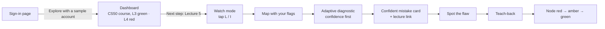

# Lectheo Product Specification

> **Find what you missed. Prove what you know.**
> *(Preferred tagline. Alternative: "Don't just record the lecture. Understand it.")*

**One-line pitch:** Lectheo uses your lecture to find what you personally don't understand, then makes you reason with it instead of just recalling it.

**Name:** **Lectheo** (LEK-thee-oh). *Lect-* from lecture (Latin *lectio*, "a reading") + *theo-* from Greek *theōria*, "seeing, understanding". Chosen on 4 Oct 2026 to replace the earlier working name "Lectio", which clashed with existing lecture apps (see [[Lectheo Competition#6. Risks and implications for the spec|Competition §6]]).

**Category:** AI study partner for university students. Built for the ForgeHacks 2026 AI + Education track: *"help learners move beyond memorization to understand concepts, make connections, and apply what they learn."*

**What changed in v2:** the scope was cut to fit one developer, following the [[Lectheo Design Review v1]]. New in this version: a sign-in page with a per-visitor sample account, a CS50 lecture library with watch mode, importing recorded lectures (Teams, Panopto, Zoom), an adaptive diagnostic, a stricter mastery rule, spot the flaw as the main activity, and requirements for consent and privacy.

---

## 1. Problem

Students leave long, concept-heavy lectures in one of two states:

1. **Too little.** They zoned out or got lost partway, and the gap snowballs because later material builds on it.
2. **Notes they never process.** The recording or notes sit unused, or get skimmed once before an exam.

When students do review, they mostly **reread or do recall quizzes**. These build *familiarity* (the "I've seen this before" feeling), not *understanding*. Rereading is among the lowest-utility study techniques (Dunlosky et al., 2013), and students often can't tell familiarity from understanding until an exam asks them to apply an idea to a new problem. That illusion of competence is a well-documented calibration failure.

**What's missing:** nobody tells a student
- *which specific ideas* they don't understand (as opposed to what the lecture covered), or
- *whether they can apply* those ideas to a situation they haven't seen before.

Students also miss gaps they don't notice. A topic they marked as "lost" may come from an earlier concept they *thought* they understood.

### Target user

- **Primary:** university students in concept-heavy courses (computer science, engineering, the sciences, economics and the like), where ideas build on each other and can be quietly misunderstood. *Broadened 8 Oct 2026 from CS only: the method isn't CS-specific; CS stays the reference content and the evaluated subject.*
- **Reference content:** **Harvard CS50x 2026, Lectures 3 (Algorithms), 4 (Memory) and 5 (Data Structures).** These are high-quality, widely recognized, and full of classic misconceptions (Big-O, pointers, swap-by-value, hash-table cost). Generated questions can be checked for correctness. Used under CC BY-NC-SA 4.0 (see [[#F7. CS50 lecture library — Must|F7.4]]).
- **Device:** laptop running Chrome, in the lecture hall or watching a recorded lecture. Tablets and phones are out of scope.

---

## 2. Solution

Lectheo is a **web app** that turns a lecture into a personal map of understanding, then trains reasoning on the weak spots.

1. **Capture:** the student marks moments while *first* experiencing the lecture. They press **L** ("I'm lost") or **I** ("Important") while watching a recorded lecture in Lectheo, or while recording a live one. They never need to rewatch anything.
2. **Map:** Lectheo builds a concept map of the whole lecture from its transcript (and slides, if provided). The student's markers sit on top as a personal layer.
3. **Diagnose:** a short, adaptive, confidence-rated diagnostic finds out what the student actually doesn't understand. The key finding is a **confident mistake**: a concept the student is sure about and gets wrong, confirmed by a follow-up question.
4. **Practice:** targeted reasoning activities make the student *use* each idea, led by **spot the flaw** and supported by **teach-back**.
5. **Master:** each concept moves from gray to red, amber and green. Green requires showing understanding independently, in two different ways.

**Design principle:** every activity tests *understanding and application*, never definition recall. All feedback points back to the exact lecture moment it came from.

---

## 3. Features

**Priority key**
- **Must:** ships for the hackathon. The judge path depends on it.
- **Should:** build in the listed order if Must is done and solid.
- **Later:** README "next steps". Not built.

Anything visible in the UI must work. Unbuilt features are hidden, not shown as broken buttons.

### F0. Accounts, sample account and dashboard — Must

| ID | Requirement | Priority |
|---|---|---|
| F0.1 | **Sign-in page** with two options: **Continue with Google** (a real account) and **Explore with a sample account**. | Must |
| F0.2 | "Explore with a sample account" gives **each visitor their own fresh copy** of a pre-seeded student. Visitors never share data, and every click starts clean. Bot protection (a CAPTCHA-style check) runs on this button. | Must |
| F0.3 | The sample account is **lived-in, not empty**. In the CS50 course: Lecture 3 has been watched and practiced (mostly green and amber), Lecture 4 has been watched with a diagnostic done and one **confident mistake** (red), and **Lecture 5 is new: "Ready to watch"**. | Must |
| F0.4 | The **dashboard is the real product dashboard**. It shows course cards with mastery progress, a lecture list with status, the concept map entry point, and a **"Next step" card** from the practice recommender (e.g. "Lecture 5 is ready. Watch it and tap when you're lost"). It contains no tour and no "demo" banner. The dashboard **follows the student's own work**: it centres on the course they last worked in, and a lecture of theirs that has just finished processing takes priority. | Must |
| F0.5 | The account menu shows a small label, **"Sample account · progress resets when you leave"**, plus a **Reset sample** action. | Must |
| F0.6 | Sample accounts are deleted automatically after 24 hours. Google accounts persist until the user deletes them: **Delete account** in the account menu opens a confirm dialog that names the consequence ("This deletes your courses, lectures, marks and practice, and signs you out. It can't be undone."), then removes all their data, their stored files and their sign-in. | Must |
| F0.7 | Users can create their own courses and add lectures (sample accounts: one course, within the [[#F8. Trust, privacy and limits — Must\|F8.3]] limits). Students can **rename** their own courses and **delete** them (confirm dialog; deletes the course's lectures, map, marks and practice). The **lecture library** ([[#F7. CS50 lecture library — Must\|F7]]) belongs to the **sample account only**: Google accounts never see it listed, recommended or reachable (a library URL returns not found). | Must |
| F0.8 | **Google accounts get a fresh start.** A new Google account has no courses and no library. Its dashboard is a first-run screen with one primary action, **Add your first lecture**, which: explains the loop in three short steps (mark, diagnose, practice); says what to bring (a recording plus its `.vtt`/`.srt` file, an audio file, or a transcript); sets expectations (for a 60-minute lecture the map is ready in about 3 minutes and questions in about 8); and links to the sample account for anyone who wants to look around first. | Must |
| F0.9 | While a student's first lecture processes, the dashboard shows its pipeline steps and status in place of the next-step card, and the page is safe to leave. When it reaches `map_ready` the map opens; at `ready` the next-step card offers the diagnostic. | Must |
| F0.10 | The **next-step card explains itself**. Besides the action, it shows: **why** (up to two pieces of the student's own evidence, e.g. "You marked *I'm lost* at 12:41 in Lecture 5", "Sure but wrong, twice, in the diagnostic", each linking to its lecture moment when there is one); **how long** ("About 5 minutes"); and **what it leads to** (e.g. "One more independent win in a different activity → Mastered"). Every number shown must come from real data or a fixed, honest estimate. | Must |
| F0.11 | Under the card, **Also worth doing** lists the next two ranked concepts, each with its mastery badge, a one-line reason and a start action. Hidden when there are none. | Should |
| F0.12 | **No dead end.** When every concept in the course is Mastered, the card suggests *Stump the AI* on the concept mastered longest ago. If the student also has nothing else to do (no unwatched or unprocessed lectures), it suggests adding the next lecture. "All caught up" alone is never shown. | Must |

### F1. Capture with markers — Must (by mode)

There are four ways to add a lecture. All of them feed the same pipeline after the transcript step.

| Mode | What the student provides | What Lectheo does | Priority |
|---|---|---|---|
| **A. Watch mode (library)** | Nothing. They pick a library lecture. | Plays the embedded video. The student taps L / I. The transcript and map are already prepared. | **Must** (the judge path) |
| **B. Import a recorded lecture** | A recording file (e.g. Teams MP4) **plus its transcript** (.vtt / .srt) | Plays the video **from the student's own laptop, never uploaded**, while they tap L / I. Only the transcript is uploaded and processed, so no transcription cost. | **Must** |
| **C. Record live** | A microphone, during an in-person lecture | Records audio in the browser while the student taps L / I. Uploads on stop, then transcribes. | **Should** (slim version; hidden if not solid) |
| **D. Upload audio only / transcript only** | An audio file (mp3, m4a, webm, wav), or a transcript file / pasted text | Transcribes the audio, or uses the transcript directly. No live markers. | **Must** (cheap fallbacks) |

| ID | Requirement | Priority |
|---|---|---|
| F1.1 | Press **L** ("I'm lost") or **I** ("Important") to save a marker at the current lecture time. On-screen buttons do the same. Shortcuts are **ignored while a text field has focus**. | Must |
| F1.2 | Markers are made during the student's **first experience** of the lecture: live, or the first viewing of a recording. There is no separate "replay and re-mark" feature. | Must |
| F1.3 | Visible but unobtrusive confirmation when a marker is saved (counter + toast). Markers can be undone within 5 s. | Must |
| F1.4 | **Watch mode (A):** embedded YouTube player for library lectures. Marker time = player time, so markers line up exactly with the official timestamped transcript. | Must |
| F1.5 | **Import (B):** the student picks a local video or audio file plus a **.vtt or .srt** transcript. The media plays from the local file and is never uploaded. Only the transcript is uploaded. **Speaker names are stripped** on import. | Must |
| F1.6 | **Upload audio (D):** mp3 / m4a / webm / wav up to the per-account size limit ([[#F8. Trust, privacy and limits — Must\|F8.3]]). Lectheo transcribes it with vocabulary from the slides if they were provided ([[#F1. Capture with markers — Must (by mode)\|F1.9]]). Audio is **deleted after transcription**. | Must |
| F1.7 | **Upload transcript only (D):** .vtt / .srt / .txt or pasted text. **Plain text has no timestamps**, so the map and diagnostic still work but there are no markers, and the UI says so. | Must |
| F1.8 | **Record live (C):** in-browser audio recording with the screen kept awake and a "keep this tab open" warning. Audio is saved in pieces as it records, so a page refresh or crash doesn't lose it, and the student is offered to upload what was captured. Max 2 h (Google) / 20 min (sample). | Should |
| F1.9 | Slides PDF (text only) as an optional extra input, used for transcription vocabulary and concept extraction. | Should |
| F1.10 | Transcript correction: edit transcript text, then **Re-process**. Rebuilds the map; previous practice history is kept. | Should |
| F1.11 | A **recording consent** prompt before the first recording or upload: "I have permission to record or use this lecture." | Must |
| — | *Later:* video upload or in-browser audio extraction from video, marking during a live Teams meeting with later alignment (timestamp offset), picture-in-picture mini controller, whiteboard and slide photos, pulling recordings directly from Teams/Microsoft 365, any YouTube URL. | Later |

### F2. Concept map — Must

| ID | Requirement | Priority |
|---|---|---|
| F2.1 | Built from the **whole lecture** (transcript, plus slides if given), not only the marked moments. | Must |
| F2.2 | **Node count scales with length:** about 1 concept per 3 minutes, **min 3, max 20** per lecture. Labeled relationships: *depends on*, *is a type of*, *part of*, *contrasts with*, *causes*, *example of*. | Must |
| F2.3 | Markers are an overlay: **lost = flagged**, **important = starred**, each linked to its moment. Markers that don't match any concept (e.g. during an anecdote) appear as **unlinked** on the lecture timeline. | Must |
| F2.4 | Each node links to its source moments (timestamp + transcript excerpt). | Must |
| F2.5 | **Prerequisite links** let a "lost" topic be traced back to an earlier weak concept. | Must |
| F2.6 | Maps are **per course**. Lectures in a course link into one map. The library course comes with these links already built. | Must (library) · Should (own courses) |
| F2.7 | **Deduplicate:** new concepts are matched against existing ones in the course. | Should (own courses) |
| F2.8 | **Accessible alternative:** a list view of concepts with state, markers and links. The map is keyboard-navigable. | Must |
| F2.9 | Edge case: a lecture with very little conceptual content (e.g. an admin session) shows a short map with an explanatory empty state rather than inventing concepts. | Must |
| F2.10 | *(built 8 Oct 2026)* **The map gets the full content width.** Clicking a node opens the concept panel as a sheet over the map's right side (`panel-width`, closed with Esc or ✕) instead of a permanent column. Phones: one column, the panel as a full-height sheet, as today. | Must |
| F2.11 | *(built 8 Oct 2026)* **Your markers** (the per-lecture L/I timeline, F2.3) moves below the map at full width. Each track runs over the **real lecture length** with its start and end time under it, shows the lecture's **chapter ticks**, and keeps its dots inside the track. Fewer dots cluster because the track is about three times wider. | Must |

### F3. Adaptive, confidence-rated diagnostic — Must

| ID | Requirement | Priority |
|---|---|---|
| F3.1 | **3–6 core questions**, scaled to the number of concepts. Selection order: concepts marked lost → concepts marked important → unmarked baseline concepts. **No markers** → baseline-only, with a note. | Must |
| F3.2 | Questions test **understanding**, not definitions. Wrong options are built from **real misconceptions**. | Must |
| F3.3 | The student rates **confidence before seeing the answer options**: *Sure / Unsure / Guessing / No idea*. This is required, but "No idea" is always available. | Must |
| F3.4 | **Immediate feedback after each question** (not batched): correct or not, why their choice is wrong, and a link to the lecture moment. | Must |
| F3.5 | **Adaptive follow-up:** a *sure + wrong* answer triggers one follow-up question on the same concept. Wrong again → **Confident mistake** (headline finding). Right → **Possible slip** (shown softly). Max 2 follow-ups per diagnostic. | Must |
| F3.6 | Results are ordered: confident mistakes → wrong → unsure-but-right → right. | Must |
| F3.7 | Only questions that passed **independent verification** are shown ([[#8. Product quality rules\|§8.1]]). If fewer than 3 verified questions exist, the diagnostic runs shorter and says so. | Must |
| F3.8 | Results set the initial mastery state ([[#F6. Mastery map — Must\|F6]]) and the practice order ([[#F4. Understanding-level practice\|F4]]). | Must |
| F3.9 | **Baseline spread across the lecture:** after marked concepts (F3.1 order unchanged), unmarked baseline concepts are taken **one per chapter in turn** (chapter order, learning order inside a chapter), so a run without marks no longer asks only about the first minutes. Lectures without chapters spread evenly through lecture order. *As built:* when a short run has more chapters (or, without chapters, more baseline concepts) than free slots, the chapters it visits are spread evenly too, so it never asks only about the first chapters (`planDiagnostic`, `packages/domain`). A concept's chapter is the one holding its first segment in the lecture. | Must |
| F3.10 | **Coverage and "test the rest":** the results show "Tested 6 of 14 concepts" and, per chapter, "Chapter 3 · 2 of 3 tested". If any concept of the lecture is still *Not tested*, the results end with **Test the other 8 →**, which starts a new round of one question per untested concept (in chapter order, at most 8 per round, repeatable) under the same rules: confidence first, immediate feedback, follow-ups (max 2 per round), verified items only. The first round stays short and targeted. *As built:* a concept that recurs from an earlier lecture is asked with a question from the lecture that introduced it, once that lecture is ready (that is where its questions live; follow-ups use the same rule). With more than 8 untested concepts the link reads **Test 8 more →**, with one **Test the last one →**. The per-chapter caption uses the chapter's number in the lecture, with its title for screen readers and on hover. The coverage line sits under the question summary, above the findings. The dashboard's next step is unchanged: after the first round the lecture is no longer a pending diagnostic, and *Test the rest* is offered on the results. | Must |
| F3.11 | **Every concept can be tested:** the pipeline already drafts two diagnostic questions per concept for user lectures (the CS50 library has them too). A concept left with no verified question after the redraft round counts as "No checked question yet" in the coverage line, never as tested, and is skipped by *Test the rest*. | Must |

### F4. Understanding-level practice

Activities are ordered by the recommender: confident mistakes → red → marked lost → amber → prerequisites of red concepts.

#### F4c. Spot the flaw — Must (the main activity)

| ID | Requirement | Priority |
|---|---|---|
| F4c.1 | A short scenario (**3–5 sentences**) about the concept. **About 70% contain exactly one planted flaw; about 30% are fully correct.** "No flaw" is a valid answer. | Must |
| F4c.2 | Every scenario is **verified before use**: the flaw is real and the only one, or the scenario is fully correct as claimed. | Must |
| F4c.3 | The student can question an **"author" persona** (up to **6 questions**). The author believes the scenario is correct and **is never told the flaw**, so it can't reveal it. Every reply passes a leak check before it's shown. | Must |
| F4c.4 | A **2-step hint ladder** (general, then specific). Any hint used marks the attempt as *assisted*. | Must |
| F4c.5 | The student submits a **verdict** (flawed / correct) and, if flawed, the **flawed sentence** and a **correction**. | Must |
| F4c.6 | **Scoring:** verdict and sentence location are checked **exactly, in code**. Only the correction is graded by an AI judge against a fixed rubric written when the scenario was created. Flawed scenario: verdict 2 + location 2 + correction 0–2 = 6. Correct scenario: verdict 2 = 2. *Correct* ≥ 5/6 (or 2/2), *partial* 3–4, *incorrect* ≤ 2. | Must |
| F4c.7 | **Consistency target:** the same correction gets the same judge result in ≥ 95% of repeated runs on the test set ([[#8. Product quality rules\|§8.2]]). | Must |
| F4c.8 | **Socratic retry:** after the first submission the student gets a guiding question and **one retry**. After the final submission, the full explanation and the rubric criteria are revealed. | Must |
| F4c.9 | A user never gets the same scenario twice. | Must |
| — | *Later:* difficulty tiers. | Later |

#### F4a. Teach-back — Must (supporting activity)

| ID | Requirement | Priority |
|---|---|---|
| F4a.1 | The student explains the concept in text to an AI "confused friend" who asks follow-up questions (up to 6 turns). | Must |
| F4a.2 | One persona at launch (a curious first-year). A persona picker (e.g. skeptical engineer) comes later. | Must · Should (picker) |
| F4a.3 | Graded against the concept's **key points from the lecture** (the rubric is fixed when the activity starts). The judge sees the friend's questions and the student's answers. | Must |
| F4a.4 | Socratic feedback with one retry (same pattern as [[#F4c. Spot the flaw — Must (the main activity)\|F4c.8]]). | Must |
| — | *Later:* push-to-talk voice. | Later |

#### F4b. Transfer problem — Should

| ID | Requirement | Priority |
|---|---|---|
| F4b.1 | A **new scenario the lecture never covered** that needs the same concept. | Should |
| F4b.2 | Graded by the judge against a fixed rubric (model solution + 2–4 criteria), with Socratic retry. | Should |

#### F4d. Stump the AI — Should (labeled "beta")

| ID | Requirement | Priority |
|---|---|---|
| F4d.1 | The student writes a hard question about the concept **and their own answer key**. | Should |
| F4d.2 | A **referee** checks the question is valid, on-concept and unambiguous, and that the key is correct (lecture content plus standard course knowledge). It rejects with a reason otherwise. | Should |
| F4d.3 | The AI answers without seeing the key. The referee compares the AI's answer to the key. | Should |
| F4d.4 | The outcome is shown as **Accepted** or **Accepted · you stumped the AI**. There are no points. An accepted question counts as one non-MCQ activity type for mastery. | Should |

### F5. Socratic feedback — Must

| ID | Requirement |
|---|---|
| F5.1 | Feedback order: a **guiding question** first, then a hint, then the full explanation only after a retry or an explicit "Show me". Asking to see it marks the attempt as assisted. |
| F5.2 | Every piece of feedback **links to the lecture source** (timestamp + excerpt). |
| F5.3 | Never just gives the answer on the first try. |

### F6. Mastery map — Must

| State | Rule |
|---|---|
| ⚪ **Not tested** (gray) | No graded attempts yet. |
| 🔴 **Needs work** (red) | The most recent attempt is wrong, **or** there is an unresolved *confident mistake* (not followed by an independent correct answer). |
| 🟠 **Getting there** (amber) | Has a correct or partial answer but doesn't meet green. Includes unsure-but-right and hint-assisted correct answers. |
| 🟢 **Mastered** (green) | **Two independent correct answers in two different activity types, at least one of them not multiple choice**, and nothing wrong since. "Independent" means: in the diagnostic, the student was **Sure**; in practice activities, no hints or explanations were used. The Socratic guiding question after a first try doesn't count as help, so a correct retry is still independent. |

| ID | Requirement | Priority |
|---|---|---|
| F6.1 | Colors appear on the map **with icons and text labels**, never color alone. A tooltip explains *why* ("Correct in Diagnostic and Spot the flaw"). | Must |
| F6.2 | One correct answer can never turn a node green. | Must |
| F6.3 | No points, XP, leaderboards, badges or streaks. | Must |

### F7. CS50 lecture library — Must

| ID | Requirement | Priority |
|---|---|---|
| F7.1 | The library contains **CS50x 2026 Lectures 3, 4 and 5**, processed in advance from the **core 30–45 minutes of each**, using the official timestamped subtitles and slides. | Must |
| F7.2 | The library course has full cross-lecture links (e.g. arrays → pointers → linked lists). | Must |
| F7.3 | A complete **bank of verified practice items** is generated in advance for every concept: 2 diagnostic variants, 2 flaw scenarios, a teach-back rubric, and a transfer problem. Lecture 5 includes at least one classic-misconception question (e.g. "hash table lookup is always O(1)"). | Must |
| F7.4 | **License notice** on every library page: "CS50x 2026 by Harvard University, CC BY-NC-SA 4.0. Adapted by Lectheo (questions and maps generated). Not affiliated with or endorsed by CS50." Generated library content is shared under the same license. Videos are embedded, not re-hosted. | Must |

### F8. Trust, privacy and limits — Must

| ID | Requirement |
|---|---|
| F8.1 | Consent prompt before recording or uploading ([[#F1. Capture with markers — Must (by mode)\|F1.11]]). |
| F8.2 | **Delete lecture**, **delete course** and **delete account** remove media, transcripts, markers and all derived content. Uploaded audio is deleted automatically after transcription. Imported video never leaves the laptop. |
| F8.3 | **Fair-use limits** (shown when hit, with the reset time): sample account 1 lecture per day (≤ 20 min, ≤ 20 MB); Google account 3 per day (≤ 2 h, ≤ 50 MB). Activities are limited per day. |
| F8.4 | **AI unavailable mode:** if the AI budget runs out, practice on already-prepared items and the map still work, and new processing pauses with a clear message. |
| F8.5 | The README states which providers receive data (transcription, AI models) and what is stored. |

### F9. Study mode — Must

*Decided and built 7 Oct 2026.* Students don't want to sit through a 2-hour lecture before they can be tested. Study mode lets them take in a lecture in minutes, mark what's unclear, then go straight to the diagnosis. *Redesign decided and built 7 Oct 2026 (F9.9–F9.15):* the brief felt like one long, flat list and too thin to prepare for the diagnosis, so it is organised by chapter with an outline, and each concept can be explained in depth.

| ID | Requirement | Priority |
|---|---|---|
| F9.1 | Every lecture with a map has a **Study** view: a reading page (the lecture page's **Study \| Watch \| Transcript** switch, Study selected by default once the map exists). It is available from `map_ready`. | Must |
| F9.2 | Concepts appear in **learning order**: prerequisites first (the map's *depends on* links), ties by first appearance in the lecture. Each concept shows its name and mastery badge, "Builds on: …" links to its prerequisites, the one-line summary, its **key points** (each with a `▶ 12:41` lecture link) and **Watch this part** with the total clip time. *As built:* `▶` plays that moment in the block's player; a key point cited in an earlier lecture links to that lecture's transcript. | Must |
| F9.3 | **Watch this part** plays the concept's source moments (neighbouring moments merged into short ranges) in an **inline mini player** inside the block. Lectures without media show the transcript excerpt instead. | Must |
| F9.4 | **I'm lost here** and **Important** on each concept create normal markers linked **directly to that concept** (no time-window alignment), with capture `study`, at the concept's first source moment. They feed the diagnosis like watch-mode markers. Hidden for lectures without timestamps. *As built:* each is a toggle; pressing it again undoes the mark. | Must |
| F9.5 | The header shows "N concepts · about M min to read · H min of video". A **Test me** button (the diagnostic) is always visible and ends the page: "Ready? Find out what you misunderstood." *As built:* at `map_ready` Test me shows "Opens once the questions are ready." | Must |
| F9.6 | No reading progress is tracked: no ticks, percentages or "read" states. Marks and the diagnostic are the only signals. | Must |
| F9.7 | The next-step card offers **Study** first for a lecture the student hasn't started ("Study Lecture 5 · about 5 min"), with **Watch** second and a quiet **Skip to the diagnostic**. *As built:* the button reads "Study Lecture 5" and the card's caption gives the brief's reading time ("About 5 minutes"). | Must |
| F9.8 | **Key points are shown to students.** This changes ADR-009: key points stop being secret. Teach-back still grades against them (now "explain it in your own words"); answer keys, flaws, rubrics, hints and leak keywords stay hidden. Mastered still needs two different activity types. | Must |
| F9.9 | The summary and key points come from extraction at no extra cost. *Amended 7 Oct 2026:* was "no new AI text"; the in-depth explanations (F9.13) are one extra AI call per lecture. | Must |
| F9.10 | **Organised by chapter** (F11): each chapter is a section (title, time range, its one-line summary, **Play this chapter** in the inline mini player, chapter-level *I'm lost* / *Important* as in F11.4); its concepts follow in learning order. A concept sits in the chapter where it **first appears**; a later chapter that revisits it shows "Also revisits: Hash functions →". A concept outside every chapter goes to the nearest one. Chapters without concepts (announcements, Q&A) are one collapsed line with **▶ Play**. Lectures without chapters keep the flat list (F9.2). *As built:* the grouping is `byChapter` in `packages/domain`; a concept with no timed moment goes to the first chapter that lists it. A chapter with no concept of its own but one to revisit keeps its full header with "Also revisits". Chapter marks are the quiet icon buttons of the watch page's Chapters tab. Without playable media there is no **Play** button. | Must |
| F9.11 | **Outline:** on desktop a sticky left rail lists the chapters with their reading time (concept-free chapters greyed), highlights the section in view and ends with **Test me**; on phones it is a sticky **Jump to** menu under the header. Highlighting where you are is not progress tracking (F9.6 holds). *As built:* the rail shows from 1024px wide, the **Jump to** menu below that; a chapter that only revisits reads "Revisits 2 concepts", one without any "No concepts" (greyed). | Must |
| F9.12 | **Quieter concept blocks:** every key point still shows, its time moved to the right in muted `mono-sm`; the "In chapter N" line (F11.5) goes, as the section replaces it; the clip button reads **Watch from 12:52 · 1 min 30 s** so its length isn't read as a start time. | Must |
| F9.13 | **Explain in depth:** each concept has a collapsed **Explain in depth · 3 min read** with four parts: **How it works** (2–4 short paragraphs, each citing lecture moments as `▶` links), **Worked example** (a trace or code; anything beyond the lecture is labelled so), **Common mistakes** (2–3 misconceptions and why they fail) and **Connects to** (its *builds on* / *leads to* concepts from the map, no AI). Labelled "AI-written from the lecture". The header adds the depth time: "about 15 min to read · 40 min with depth". *As built:* "with depth" is the reading time plus all depth text (words ÷ 200, code included). The disclosure is hidden for a concept without depth. | Must |
| F9.14 | **Grounded and safe:** the writer gets the concept's transcript segments and cites them by segment index (`[s42]`), never by time; the server turns them into lecture links. Validated: every *How it works* paragraph cites at least one real segment of the lecture. The writer never sees answer keys, flaws, rubrics, hints or leak keywords (ADR-009). **No outside links**: resources are the lecture's clips and the linked concepts. *As built:* a citation outside the lecture is dropped. A paragraph left without one, a URL anywhere (code included), or fewer than 2 paragraphs or 2 mistakes drops that concept's depth, never the lecture; extra paragraphs (over 4) and mistakes (over 3) are trimmed. Text is capped (1,200 characters, code 3,000, 8 citations a paragraph) and bare domains count as URLs. **Accepted on purpose** (review of 8 Oct 2026): *Common mistakes* is written from the same key points and segments the item drafter uses, so it can describe the misconception a question or spot-the-flaw scenario tests. Reading the brief before the diagnostic is the intended flow, nothing secret is passed, and Mastered still needs two activity types; if it makes the diagnostic too easy, the follow-up is an overlap check in `verifyItems`, not hiding depth. | Must |
| F9.15 | **Generated in the pipeline:** one call per lecture after `map_ready`, in parallel with item drafting, so `ready` comes no later. If it fails, the lecture still turns ready and *Explain in depth* is hidden for it. Re-processing replaces it. A concept deduplicated into an earlier lecture keeps that lecture's explanation. The **CS50 library** gets it through a one-off script on the dev key (stable ids unchanged). About $0.10 per lecture. *As built:* the `explainConcepts` step makes one call per batch of 6 concepts (at most 4 at once), so a 2-hour lecture's ~20 concepts fit the output budget and a failed batch only leaves its own concepts without depth. It retries once (not three times) and is not on the progress bar; the run waits for it to settle before finishing, and an item failure still fails the lecture. It clears the lecture's own explanations before writing, so a failed re-process leaves none rather than stale ones. The library script (`scripts/library-depth.ts`) explained all 18 concepts for $0.24. | Must |

### F10. YouTube lectures — Should (after a spike)

*Decided 7 Oct 2026. The spike **passed** on 7 Oct 2026 (`docs/spikes/youtube-transcripts.md`); built 7 Oct 2026; the F10.9 check on a second lecture passed after the review (clean-verbatim prompt).* Students learn from long YouTube lectures too. They paste a link and get the same map, brief, diagnosis and practice.

| ID | Requirement | Priority |
|---|---|---|
| F10.1 | **Spike first** (no product code): can a Gemini model read a public YouTube URL through Vercel AI Gateway (else a direct Google AI key with its own budget) and return a timestamped transcript? Pass if, on CS50 Lecture 3 against its official subtitles, 95% of cue times are within 5 s, word errors are under 10%, cost is ≤ $0.50 per hour of video and a 60-minute video is ready in about 5 minutes. Results go to `docs/spikes/youtube-transcripts.md`. If it fails, F10 is dropped. **Result: PASS (7 Oct 2026)** on a 60-minute run: 5.5% word errors, 97.3% of cue times within 5 s (p95 2.6 s), $0.42 per hour of video, 40 s wall time. Only through a **direct Google key**: the gateway passes the link but ignores the clip offsets, so it bills the whole video. | Must (gate) |
| F10.2 | **Add lecture → From YouTube**: paste any YouTube link form (`watch?v=`, `youtu.be`, `&t=`, playlist, mobile); only the video id is kept. A preview card shows thumbnail, title, channel and duration (YouTube Data API). | Should |
| F10.3 | Checked **before any AI spend**: public or unlisted, embedding allowed, not live or upcoming, at least 5 minutes, English audio (v1), within the tier limit (Google ≤ 2 h; sample ≤ 20 min). Each refusal names the reason. Embedding disabled → refused. **Age-restricted** (`ytAgeRestricted`) → refused (the embed needs sign-in). The Data API language must be `en*`, and the transcript is checked again for English, because the uploader-set language can be wrong. Gemini refuses none of these itself, so every check happens here. *As built:* the checks run in `server/youtube.ts`, on the preview and again in `POST /lectures`; a video without any language set is not refused (the transcript is checked instead); a transcript that turns out not to be English fails like *no speech*. Both verdicts are cached per video (`youtube_transcripts.refusal`), so the same video is refused before any spend next time; the refund is at most one per student per day. | Should |
| F10.4 | A consent tick, "I'm using this video for my own study", then the lecture is created with source `youtube` and processed. It counts as one lecture against the daily quota (sample accounts included: 1 per day). | Should |
| F10.5 | The pipeline transcribes the video in **2-minute chunks** run in parallel (at most 10 at a time) with `gemini-3.8-flash` on the **direct Google API** (low media resolution, cue times as `H:MM:SS`), stitched with the spike's rule (trust a cue that starts inside its chunk and after the previous one; otherwise re-time it after the previous cue at ~350 ms per word; drop a word repeated across a boundary). A chunk that comes back empty while its neighbours have speech, or with most cues untrusted, is retried once; 429/503 are retried with backoff. It then checks the result (cues in order, inside the video, no large gaps) and continues with the normal steps. No speech → the step fails with "We couldn't find speech in this video" and the quota is refunded. *As built:* the step runs one wave of at most 10 chunks per call (240 s deadline, 90 s per request) and stores each chunk as it finishes (`youtube_transcript_chunks`), so a crash or Retry never pays for finished chunks; the workflow repeats it until done. A chunk whose output fails its checks twice counts as empty; a Google 4xx (video made private or removed) fails the lecture at once. Every empty chunk between speech (or next to it) is retried once; only chunks that stayed empty after that retry count as silence rather than a gap, and the gap limit is 10 minutes. A Retry, with or without `?from=`, is refused for failures it can't change (no speech, not English, incomplete, unavailable), and nothing is transcribed while the F10 switch is off. | Should |
| F10.6 | Transcripts of public videos are **cached by video id** and reused across students; each student still gets their own map, marks and practice. | Should |
| F10.7 | Watch and Study use the YouTube embed (marks work as in the library). If the embed fails, show "Open on YouTube"; there is no audio fallback. The video is never downloaded. | Should |
| F10.8 | Privacy page and README list Google (Gemini, transcription of YouTube links) and the YouTube Data API. | Should |
| F10.9 | **Before shipping:** the spike's scorer is run on **one more lecture with human captions** (e.g. MIT OpenCourseWare) and must meet the F10.1 targets. Direct Google costs are written to `llm_calls` (priced from Google's token counts at list price, their own key label) so the spend governor counts them. The Google project has **billing on** (paid tier: no training on our requests) and a **budget alert of about $10**. **As built (7 Oct 2026):** scored with `scripts/spikes/youtube-validate.ts` on MIT 6.006 (Spring 2020) Lecture 1, 10:00–25:00, against OCW's official captions. The first run (verbatim prompt) missed: 12.6% word errors, p95 drift 6.5 s, 93.9% within 5 s, mostly fillers the clean-verbatim captions leave out. After the review (prompt `transcribe-chunk@2` asks for **clean verbatim**; a slipped cue end is capped to its chunk), the same window with the unchanged scorer **passes**: **9.5% word errors, p95 drift 2.8 s, 99.1% within 5 s, $0.35 per hour**, 16 s, no missing stretches. Google spend is logged with `llm_calls.gateway_key = 'google'` and capped by `GOOGLE_AI_BUDGET_USD` (default $10): at 75% of it, or 25% within one hour, new YouTube lectures and Retries that would transcribe are refused (`intake_paused`); at 100% transcription stops; other features never look at it. The feature ships behind `FEATURE_YOUTUBE_LECTURES` (off: tab hidden, 404), which also needs both Google keys. | Should |

### F11. Chapters — Must

*Decided and built 7 Oct 2026, with F9.* Students want to jump to the part they need and listen to just that, like a well-chaptered YouTube video.

| ID | Requirement | Priority |
|---|---|---|
| F11.1 | Every lecture with timestamps gets **chapters**: about 8–15 per hour, each with a short title, a one-line description, its start and end, and the concepts it covers. Non-concept parts get chapters too ("Announcements", "Q&A", "Recap") so they can be skipped. Lectures without timestamps get none. | Must |
| F11.2 | Chapters come from the **existing `extractConcepts` call** (no extra AI call). The model names the **transcript line** each chapter starts at (`[s42]`), never a time; the server reads the real time from that segment, so timestamps are exact. Validated: in order, no overlaps, covering the lecture from the first to the last segment, concept references existing. *As built:* a chapter list that fails the checks is dropped (and logged), so the lecture has no chapters but its map is kept; "about 8–15 per hour" allows one chapter either side. | Must |
| F11.3 | **Watch page:** a **Chapters** tab beside Transcript lists time, title and description; the current chapter is highlighted as the media plays; clicking jumps there. Chapter ticks sit on the progress bar. **Play this chapter only** stops playback at the chapter's end. *As built:* the ticks sit on Lectheo's own progress bar under the player (the YouTube embed's bar can't be drawn on), next to "Chapter 3 of 8 · title". | Must |
| F11.4 | Each chapter row with concepts has quiet **I'm lost** / **Important** buttons. The marker (capture `study`, at the chapter's start) links **directly to every concept the chapter covers**. Chapters without concepts show no buttons. L/I during playback keep working as before. | Must |
| F11.5 | **Study page** (F9): each concept shows where it sits ("In chapter 4 · 23:10", a link). **Lecture header:** "12 chapters · 58 min". *As built:* the Study header ends with "· 8 chapters"; "8 chapters · 45 min" sits in the Transcript view's header. | Must |
| F11.6 | The **CS50 library** gets chapters through a one-off script run on the dev key; it only adds data, so the item bank and stable ids don't change. | Must |

---

## 4. User journeys

### 4.1 Judge path (target: under 2 minutes)

1. **Sign-in page:** the judge clicks **Explore with a sample account**.
2. **Dashboard:** CS50x course, Lecture 3 mostly green, Lecture 4 showing a red confident mistake on *pointers*, and a Next-step card: "Lecture 5 is ready. Study it in a few minutes and mark what's unclear.", with **Watch** beside it.
3. **Watch mode** (or **Study**, F9): the judge plays a few minutes of Lecture 5 and taps **L** when the hash-table explanation loses them.
4. **Map:** the Lecture 5 concepts appear with their flag on *hash tables*, linked back to *arrays* and *linked lists*.
5. **Diagnostic:** 4–5 questions with confidence first. They answer "Sure: lookup is always O(1)", get it wrong, get the follow-up wrong too → **Confident mistake: hash table lookup cost**, with a link to the lecture moment.
6. **Spot the flaw** on that concept: they question the author, find the flaw, and get a guiding question → retry → full explanation. Node goes red → amber.
7. **Teach-back** with the confused friend → node turns green (two independent passes in different activity types).

### 4.2 Real student (Teams recording)

Sign in with Google → **empty first-run dashboard** → Add your first lecture (creates the course) → **Import recorded lecture** (Teams MP4 + .vtt) → watch in Lectheo and tap L / I → processing shown on the dashboard → map → diagnostic → practice over the following days → map turns green. No CS50 content appears anywhere in a Google account.

### 4.3 Real student (in-person lecture)

Sign in with Google → **Record live** in the lecture hall and tap L / I → stop and upload → map in a few minutes → diagnostic → practice. *(Record live is a cut Should; until it ships, this student uploads the audio afterwards and gets the map without markers.)*

---

### 4.4 Student with a long lecture (Study mode)

Sign in → add the lecture (recording + .vtt, audio, transcript, or a YouTube link once F10 ships) → **Study** the brief in ~15 minutes, tapping *I'm lost here* on two concepts → watch only those two clips, or jump to the two chapters that sounded hard (F11) → **Test me** → the diagnostic starts with the marked concepts and finds a confident mistake → Spot the flaw → Mastered over the following days. The full video is never watched end to end.

## 5. Value proposition

**For the student:**
- **Personal, not generic.** Starts from *your* "lost" moments and *your* confident mistakes, not a generic summary.
- **Finds the gaps you don't feel.** Confidence ratings plus an adaptive follow-up uncover concepts you *think* you know. Prerequisite links trace confusion back to where it started.
- **Prove understanding, don't recall it.** Spot the flaw and teach-back require reasoning. Green means you've shown it independently, two different ways.
- **Works with lectures however you get them:** live, recorded on Teams/Panopto/Zoom, or from a lecture library. One keypress to mark. No rewatching.
- **Trustworthy.** Questions are checked by an independent AI before you see them. Feedback always cites the lecture. Grading uses fixed rubrics.

**Positioning statement:**
*For students in concept-heavy courses who leave lectures unsure what they really understand, Lectheo is an AI study partner that finds each student's specific gaps from their own lecture and trains them to reason with those ideas. Lecture recorders and AI note tools turn lectures into summaries and recall quizzes. Lectheo diagnoses misunderstanding and trains application.*

---

## 6. Competition

Full analysis, profiles, feature matrix and sources: **[[Lectheo Competition]]**.

| Segment | Examples | Why Lectheo is different |
|---|---|---|
| AI lecture note takers | Turbo AI, Coconote (Quizlet since Feb 2026), StudyFetch, Knowt, TikoNote, two apps already called "Lectio" | They turn lectures into notes, flashcards and recall quizzes, the same for every student. Lectheo diagnoses *your* misunderstanding. |
| Lecture capture with markers | Genio Notes (timestamped labels), Echo360 (confusion flags sent to the instructor) | Their markers organize notes or inform the instructor. Lectheo's markers **drive the student's own diagnosis and practice**. |
| Source-grounded AI notebook | NotebookLM / Gemini Notebook | Free and strong, but no personal markers, and its maps don't track mastery. *NotebookLM knows your sources. Lectheo knows your confusion.* |
| AI tutor modes | ChatGPT Study Mode, Gemini Guided Learning, Claude Learning mode, Khanmigo | Socratic guidance is table stakes. Lectheo adds grounding in the student's lecture and a separate judge with a fixed rubric. |
| Teach-back apps | TeachBack, TikoNote Feynman mode | Teach-back already exists, so it's a supporting activity in Lectheo, not the headline. |
| Student-authored questions | PeerWise (peer question banks), research on question generation | Established pedagogy. Lectheo's version adds an AI referee and an AI to stump. |
| Confidence-based learning | Amplifire (enterprise) | Validates confidence ratings. Use our own wording (their terms are trademarked). |

**Differentiation:** the *combination* (personal confusion markers → confidence-rated, adaptive diagnosis → spot-the-flaw reasoning practice → mastery proven two ways, grounded in the student's lecture) wasn't found in any AI lecture tool. Each piece exists somewhere. The chain is the advantage, and it's **defensible for now**, not permanently.

---

## 7. Scope boundaries

**In scope (Must):** sign-in page (Google + sample account); dashboard; CS50 library with watch mode; import recording + transcript; audio and transcript upload; markers; concept map + list view; adaptive diagnostic; spot the flaw; teach-back; Socratic feedback; mastery map; consent, deletion and limits; Study mode ([[#F9. Study mode — Must|F9]], built 7 Oct 2026, redesigned the same day: F9.9–F9.15); chapters ([[#F11. Chapters — Must|F11]], built 7 Oct 2026).

**Built 8 Oct 2026:** course page layout ([[#F2. Concept map — Must|F2.10–F2.11]]: full-width map, markers timeline below it); diagnostic coverage ([[#F3. Adaptive, confidence-rated diagnostic — Must|F3.9–F3.11]]: baseline spread across chapters, coverage on the results, *Test the rest*).

**Built 7 Oct 2026:** YouTube lectures ([[#F10. YouTube lectures — Should (after a spike)|F10]], Should), behind the `FEATURE_YOUTUBE_LECTURES` switch; F10.9 passed after the review.

**Should (in order):** record live (slim) → Stump the AI (beta) → transfer problems → slides as extra input → transcript correction → own-course dedupe → persona picker.

**Out of scope (Later):**
- Live in-lecture transcription and translation
- Mobile, tablet and desktop apps (native)

**Phones (decided 6 Oct 2026):** the landing page is fully responsive. The app is *usable* on a phone (readable, no sideways scrolling, the sidebar becomes a sheet) but desktop-first: the concept map and watch mode are designed for a laptop; on phones the map defaults to the list view and watch mode shows on-screen *I'm lost* / *Important* buttons instead of relying on L/I keys.

- Video upload; audio extraction from video in the browser
- Re-marking on replay; aligning marks made during a live Teams meeting with a later recording
- Picture-in-picture controller; slide or whiteboard photos
- Microsoft 365 / Panopto integrations
- Points, XP, leaderboards, badges, streaks
- Cross-course maps
- Voice as the main interface
- Plain notes-to-quiz generator

---

## 8. Product quality rules

1. **Correctness before display.** Questions, answer keys and planted flaws are verified by an independent AI before anyone sees them. Rejection rates are reported in the README.
2. **Consistent, explainable grading.** Exact checks in code wherever possible. The AI judge grades against fixed rubrics written before the activity, separately from any chat persona. Same answer → same result (≥ 95% on the test set).
3. **No leaking.** Personas never receive the answers or flaws, and author replies are leak-checked before display.
4. **Always grounded.** Every concept, question and piece of feedback links to a lecture source. The Stump referee may also use standard course knowledge, and says so.
5. **Text-first.** Everything except recording works without a microphone.
6. **Understanding over engagement.** Progress rewards independent, demonstrated understanding, never app opens or guessing.
7. **Honest about limits.** If an input can't be processed (bad audio, plain text with no timestamps, too few concepts), say so and offer the next best option.
8. **Privacy by default.** Consent before capture, minimal storage, speaker names stripped, easy deletion.
9. **Looks and behaves like one product.** Every screen follows [[Lectheo Design System]]: the same tokens, app shell, loading and error states, focus rules and motion.

---

## 9. Edge cases

| Situation | Behavior |
|---|---|
| No markers tapped | Diagnostic uses baseline concepts, and the result card says "No flags this time. Here's a general check." |
| Marker lands in an anecdote or admin talk | Shown as *unlinked* on the lecture timeline. Not used for question selection. |
| Very short lecture or few concepts | Map with 3+ concepts, or an explanatory empty state. Diagnostic scaled down (≥ 3 questions or skipped with an explanation). |
| Too few verified questions | Shorter diagnostic, labeled. Practice still available. |
| Student skips the confidence rating | Not possible. "No idea" is always offered. |
| Transcript has no timestamps | Map and diagnostic work. Markers are disabled, with an explanation. |
| Upload too large, or over the time limit | Clear message with options (compress, upload the transcript instead). |
| Recording interrupted (refresh, crash, sleep) | Offer to upload what was captured. Gaps are noted. |
| AI budget exhausted | Prepared practice still works. New processing and generation pause with a message. |
| Same scenario requested again | Never repeated for the same user. Another variant is served or generated. |

---

## 10. Open product questions

- [x] **Product name: Lectheo** (decided 4 Oct 2026). When checked, lectheo.com was unregistered and github.com/lectheo was free; register both. Search engines may correct it to near-misses (Lecto, LectO, Lectio), so always write "Lectheo (LEK-thee-oh)" in the README and demo video.
- [ ] Final tagline.
- [ ] Any evidence from 3–5 real students that they would tap "I'm lost" during a lecture? (Strengthens Real-World Impact.)

*Decided on 8 Oct 2026:* **Audience broadened** from CS students to students in concept-heavy courses. The method (marks, map, confidence-first diagnosis, reasoning practice) isn't CS-specific; CS50 stays the sample and the only evaluated subject, which the README states as a limit. The AI prompts that still say "CS" (personas, judges) become subject-neutral, and the landing page copy follows the Landing Copy doc, in one small PR.

*Decided on 7 Oct 2026:* **Diagnostic coverage** (F3.9–F3.11): a 3–6 question first round can leave most of a long lecture untested, and without marks it only asked about the start. Baseline questions are now spread one per chapter, the results show how many concepts were tested (overall and per chapter), and **Test the other N** runs further rounds on untested concepts only. Rejected: testing every concept every time (long, and marks would stop mattering). No extra cost: user lectures already get two diagnostic questions per concept.

*Decided on 7 Oct 2026:* **Study redesign and course layout** (F9.9–F9.15, F2.10–F2.11): the brief is organised by chapter (a concept sits where it first appears) with a sticky outline, all key points kept, quieter blocks and "Watch from 12:52 · 1 min 30 s". Each concept gets a collapsed **Explain in depth** (how it works, worked example, common mistakes, connects to), written from the lecture with segment citations, generated in the pipeline in parallel with items (≈ $0.10 per lecture), never shown 🔒 data, and **no outside links** (models invent URLs). This reverses F9.9's "no new AI text": key points alone were too thin to prepare for the diagnosis. The course page gives the map the full width (node panel as a sheet) and moves *Your markers* below it, on the real lecture length with chapter ticks, because the 352px column squeezed the map and made marker dots overlap.

*Decided on 7 Oct 2026:* **Chapters** (F11): AI chapters from the existing extraction call, anchored to transcript lines so times are exact; a Chapters tab with *play this chapter only*; chapter-level marks linked straight to the chapter's concepts; the library gets chapters by a one-off script; built in the same session as Study mode.

*Decided on 7 Oct 2026:* **Study mode** (F9): a lecture brief from the existing summaries and key points, in prerequisite order, with inline clips, *I'm lost here* marks linked straight to concepts (capture `study`), no progress tracking, Study before Watch in the next step, and **key points shown to students** (ADR-009 amended). **YouTube lectures** (F10): spike first; if it passes, Gemini transcribes public YouTube links (direct Google key if the gateway can't), transcripts cached per video, English only, embed-disabled videos refused, sample accounts allowed 1 per day ≤ 20 min.

*Decided on 7 Oct 2026:* Teams `.docx` import is dropped: real Teams exports carry one timestamp per speaker turn, which breaks marker alignment and the lecture links. Teams always offers `.vtt` from the same menu, so `.docx` adds no reach. A `.docx` upload is refused with a pointer to the `.vtt`.

*Decided on 6 Oct 2026:* self-serve account deletion · rename and delete own courses · Teams `.docx` import becomes Must (reversed 7 Oct, see above) · record live stays cut · app usable on phones but desktop-first · code licensed MIT · launch on `lectheo.vercel.app` (no custom domain) · no analytics · the author reviews the eval labels before submission.

*Decided on 6 Oct 2026:* the next-step card shows why, how long and what it leads to, plus two "Also worth doing" items, and never dead-ends (F0.10–F0.12).

*Decided on 6 Oct 2026:* Google accounts get a **pure fresh start**: no CS50 library, no opt-in to add it later. The library exists to let visitors try Lectheo through the sample account.

*Decided on 4 Oct 2026:* spot the flaw is the main activity · rubric criteria and explanation revealed after the final submission · slides input is Should · each visitor gets their own sample account · Google sign-in is real · CS50x 2026 L3–5 is the library · watch mode and Teams import are in scope.

## 11. As-built deviations

Recorded at submission (6 Oct 2026). Each deviation is deliberate; evidence is in the repo's `docs/audit/spec-compliance.md`.

| Req | Spec says | As built | Why |
|---|---|---|---|
| F0.9 | When processing reaches `map_ready` the map opens | The processing card offers **Open the map** at `map_ready`; the dashboard never navigates on its own. | The page is safe to leave and the student may be elsewhere; moving them without a click would be surprising. |
| F0.12 | Stump on the concept **mastered longest ago** | Stump on the mastered concept **practiced longest ago** (oldest latest attempt), `packages/domain/src/recommender.ts`. A lecture whose processing failed (to retry), then one still being added (*Finish adding …*), is offered before *add a lecture*. | Close enough for spacing practice without replaying every attempt to find when each concept turned green. |
| F2.2 | About 1 concept per 3 minutes (min 3, max 20) | The pipeline follows the rule (`packages/domain/src/scale.ts`). The **CS50 library** has 6 concepts per 45-minute window, where the rule gives about 15. | The library curriculum is fixed: the item bank's stable ids, the seed student and the e2e judge path depend on it. Six well-verified concepts per lecture beat fifteen thinner ones for a two-minute judge path. Student-added lectures get the full rule. |
| F2.10 | The panel is a sheet over the map's right side; phones get a full-height sheet | A non-modal card over the map (`panel-width`, `shadow-lg`): on wider screens the map stays usable behind it (another node swaps the panel) and refits so no node sits under the sheet. Esc closes it wherever focus is; focus returns to the node only if it was in the sheet or on the map. On phones it covers the map's full height and width, and the map is `inert` while it is open. | No new sheet component or focus trap; the panel already moves focus to its heading and back to the node on close. |
| F2.11 | Map `lectures[]` adds `durationMs` and `chapterStartsMs` | Also adds `startMs` (where the lecture starts in media time: a library window's start, else 0). Start and end times under each track are media times, like the dots' "12:41" titles and links. Without a length (no timestamps) the track runs to just past the last marker and shows no times. | Markers' `tMs` are media time; a library window starts mid-video, so the client needs the offset to place dots on the real axis. |
| F7.1 | Library processed from the official subtitles **and slides** | Built from the official timestamped subtitles only (`scripts/seed-library.ts`). | Slides input is a Should in the decision log (§10). Every concept and item cites subtitle timestamps, so grounding is checkable without slides. |

Built on 6 Oct 2026: F0.4 (the dashboard follows the student's own course), F0.6 (self-serve *Delete account*), F0.7 (rename and delete own courses; the CS50 library is visible to sample and owner accounts only), F0.8 (first-run screen), F0.9 (processing steps on the dashboard), F0.10–F0.12 (why, how long, payoff, *Also worth doing*, no dead end) and F8.2 (delete course and delete account).

Built on 7 Oct 2026: F9 (Study mode: the lecture brief, concept marks, Test me, Study first on the next-step card, key points shown) and F11 (chapters from `extractConcepts`, the Chapters tab, *Play this chapter only*, chapter marks, library chapters). Their as-built notes are in the F9 and F11 tables. The Study redesign (F9.9–F9.15: by chapter, outline, quieter blocks, *Explain in depth* written by the `explainConcepts` pipeline step in batches and, for the library, by `scripts/library-depth.ts`) was built the same day; its as-built notes are in the F9 table.

Also built on 7 Oct 2026: F10 (YouTube lectures: the *From YouTube* tab, Data API checks, the direct-Google `transcriber`, the `transcribeVideo` step with its per-video cache, the embed in Watch and Study with *Open on YouTube*). F10.9 passed on MIT 6.006 after the review (see F10.9). It is switched on with `FEATURE_YOUTUBE_LECTURES=1`.

Built on 8 Oct 2026: F3.9–F3.11 (diagnostic coverage: baseline spread across chapters, the coverage line on the results, *Test the rest* rounds, *No checked question yet*). Their as-built notes are in the F3 table. Also F2.10–F2.11 (the course page: full-width map with the node panel as a sheet, *Your markers* below it on the real lecture length); their deviations are in the table above.

### Should items: built or cut

| Req | Item | Status |
|---|---|---|
| F1.5 | Teams `.docx` transcripts | Dropped 7 Oct 2026: one timestamp per speaker turn breaks marker alignment and lecture links; Teams always offers .vtt. |
| F1.8 | Record live (mode C) | Cut, confirmed 6 Oct 2026. No entry point; the API returns `404` for `live`. Audio upload covers in-person lectures |
| F1.9 | Slides PDF input | Cut. No upload; no transcription keyterms from slides |
| F1.10 | Transcript correction and re-process | Cut. Contract exists, no route or UI |
| F2.7 | Deduplicate concepts in own courses | Built (normalised canonical key) |
| F4a.2 | Persona picker | Cut. One persona |
| F4b | Transfer problem | Built (shown when an unseen transfer item exists) |
| F4d | Stump the AI | Built, labeled "Beta" |
